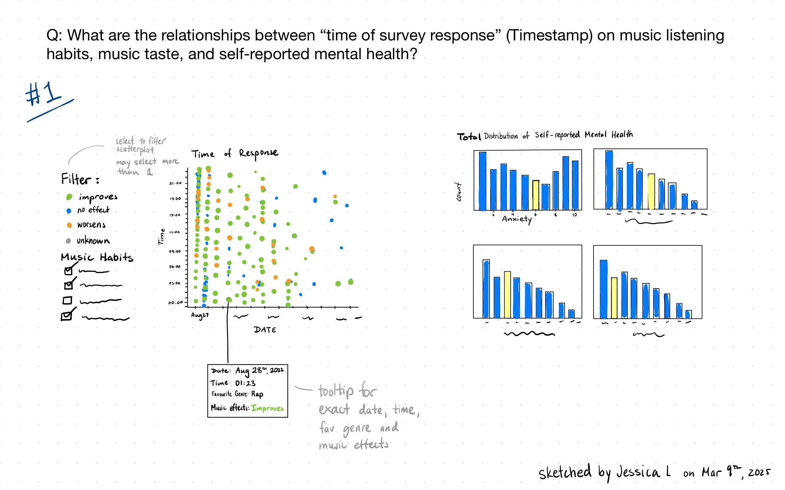
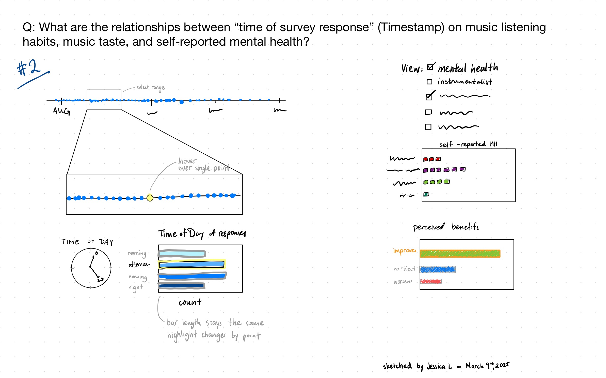
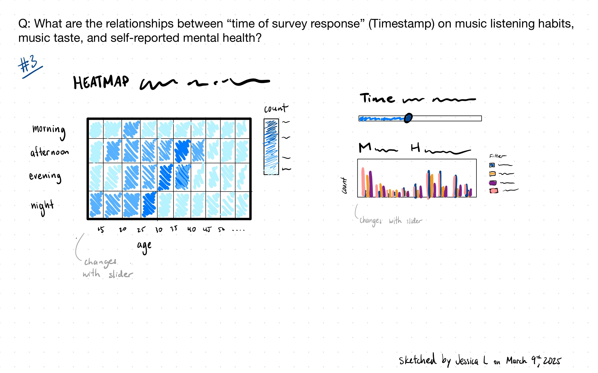

## Introduction
The [Music & Mental Health Survey Dataset](https://www.kaggle.com/datasets/catherinerasgaitis/mxmh-survey-results/data) comes from Kaggle and was compiled by Catherine Rasgaitis based on a survey about music-listening habits and their connection to mental health that respondents filled out via Google Forms. The form was posted on different social media platforms such as Reddit and Discord. The dataset has a CC0: Public Domain license and consists of 737 rows and 33 columns.

Our team is FabFour, consisting of Allison Fellhauer, Olena Sokolovska, Judy Lee, and Jessica Luo. 

Allison is currently a Bachelor of Computer Science (BCS) student interested in machine learning, data science, and artificial intelligence. Coming from a background in biology with a minor in psychology, she has a strong foundation in cognition and positive psychology—both of which explored the positive impact of music on mental health.  Her interest in the Music and Mental Health dataset stems from her passion for understanding how music influences emotional well-being and how it can uplift individuals from languishing to flourishing.

Judy is a 5th-year computer science major and data science minor with a background in product design (UX/UI). She is particularly drawn to the music and mental health survey dataset because it combines two of her passions: music and mental health. As someone who is often found listening to music, Judy has a personal connection to how it can influence emotions and well-being. The dataset resonates with her as it provides an opportunity to explore how music impacts mental health and analyze the data to uncover meaningful insights.

As a Behavioural Neuroscience student, Jessica is interested in any topic in the area of mental health. She grew up with music as a core component of life and appreciates the diversity of benefits that many people can obtain from listening, making and appreciating music. When Jessica was a Crisis Line Volunteer supporting callers with mental health challenges, she heard from many help-seekers that music was something people turned to when they felt anxious, stressed, depressed, restless or lonely.

Our intended audience includes individuals who are passionate about music or mental health, such as music enthusiasts, mental health professionals, and researchers interested in the intersection of the two fields. Since this dataset allows for the visual exploration of how different music genres correlate with mental health conditions like anxiety and depression, we aim to provide valuable insights through data visualizations. These insights will help people better understand how music influences emotional well-being and overall mental health.

## About the Data (no limit)

### Data Abstraction
| Attribute Name            | Attribute Type   | Data Semantics                                                    | Cardinality        |
|---------------------------|------------------|-------------------------------------------------------------------|--------------------|
| Timestamp                 | Temporal | The date and time when the survey form was submitted.           | 717                |
| Age                       | Quantitative     | The age of the respondent.                  | 10-89              |
| Primary streaming service | Categorical      | The primary streaming service used by the respondent.             | 6                  |
| Hours per day             | Quantitative     | The number of hours the individual listens to music per day.      | 0-24               |
| While working             | Categorical      | Whether the individual listens to music while working | 2              |
| Instrumentalist           | Categorical      | Whether the individual plays an instrument      | 2                  |
| Composer                  | Categorical      | Whether the individual is a composer           | 2                  |
| Fav genre                 | Categorical      | The favorite genre of music of the respondent.                    | 16                 |
| Exploratory               | Categorical      | Whether the individual is exploratory in terms of music genres  | 2            |
| Foreign Languages         | Categorical      | Whether the individual listens to music in foreign languages  | 2              |
| BPM                       | Quantitative     | Beats per minute of favorite genre      | 0 - 999999999      |
| Frequency [Fav genre]     | Ordinal          | How frequently the respondent listens to [Fav genre] music. | 4 each            |
| Anxiety                   | Ordinal          | Self-reported anxiety on a scale of 0-10. | 11             |
| Depression                | Ordinal          | Self-reported depression on a scale of 0-10.               | 11                 |
| Insomnia                  | Ordinal          | Self-reported insomnia on a scale of 0-10.                  | 11                 |
| OCD                       | Ordinal          | Self-reported OCD on a scale of 0-10.                      | 11                 |
| Music effects             | Ordinal          | The effect that music has on the respondent's mental health conditions?          | 3                  |
| Permissions               | Categorical      | Permission to publicize data | 1

### Exploratory Data Analysis
All four of our group's invidiual exploratory data analysis can be found under the analysis folder. We shall present the key findings in the notebook labeled "EDA Summary" located in the analysis folder.

## Research Questions (~500 words)

Jessica's research question is, 
*"How does the time of day a person responds to a mental health survey relate to their self-reported mental health, considering music background and listening habits?"*

## Task Analysis (~500 words)

- **Determine Range** - what is the range for self-reported depression severity across a certain timeframe?
  - A viewer may be curious about only responses in the first day, at night.
- **Retrieve Value** – What is the favourite genre of a person who made a response on September 21st, 2022?
  - Seeing individual points may be interesting for viewers.
- **Filter** – Given a time of day, what was the most frequently self-reported mental health condition? 
  - Filtering between certain days may allow people to explore and interact with a certain day/week/month of interest.
- 

## Preliminary Sketches (~250 words)

### Jessica's Sketches

**Retrieve Value: What is the favourite genre of a person who made a response on September 21st, 2022?**

or 

**Cluster: Is there a cluster of whether people believe music improves or does not improve their mental health based on the time of day and self-reported mental health?**

This sketch is able to be filtered by `Music Effects` which could make it easy for viewers to see the distribution of opinions or any patterns/clusters in the data across the scatterplot of time.
The tooltip makes it easy for a viewer to retrieve an exact value, but may not be good at comparing proportions of `Music Effects` or music habits (`Favourite Genre`, `Composer`, etc.)
Having the right panel of Self-Reported Mental Health ratings within similar proximity and highlighting bars to make them pop-out helps the viewer understand that they are related to the left panel.

**Filter: Given a range of time, what was the most frequent choice for `music effects`? `Intrumentalists`? `Composer`? `While Working`? etc.**

The ability to select a date range across a timeline helps reduce cognitive load, and provide the opportunity for "common fate" when the small timeline panel slides while the larger left panel shows the expanded/zoomed-in data range.
Having self-reported mental health scores change every time a single point is selected/hovered over, the viewer cannot see the overall distribution of these variables.
Allowing the user to interact by filtering for `Instrumentalists`, `Composer`, `While Working`, etc. may be overwhelming and difficult for the viewer as they have to learn what each of the panels and choices mean.

**Determine Range: what is the range for self-reported depression severity across a certain timeframe?**

This heat map component of this visualization is not effective for the task - only the right side of the panel (range bar of time and mental health severity) is effective for this task.
Grouping each different condition (anxiety, depression, OCD, insomnia) as different coloured bars may help viewers better differentiate between conditions, but having them all close together may challenge separability.

## Next Steps (~250 words)
