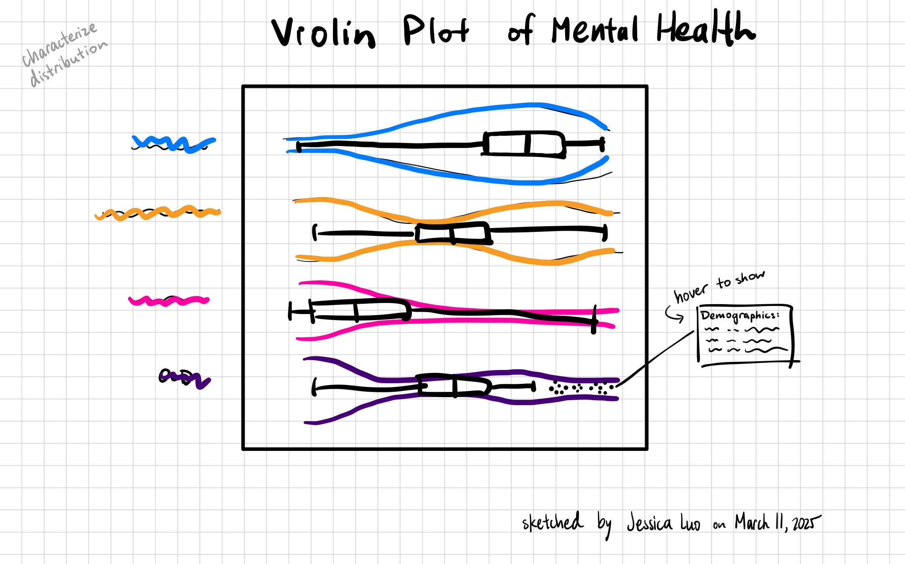
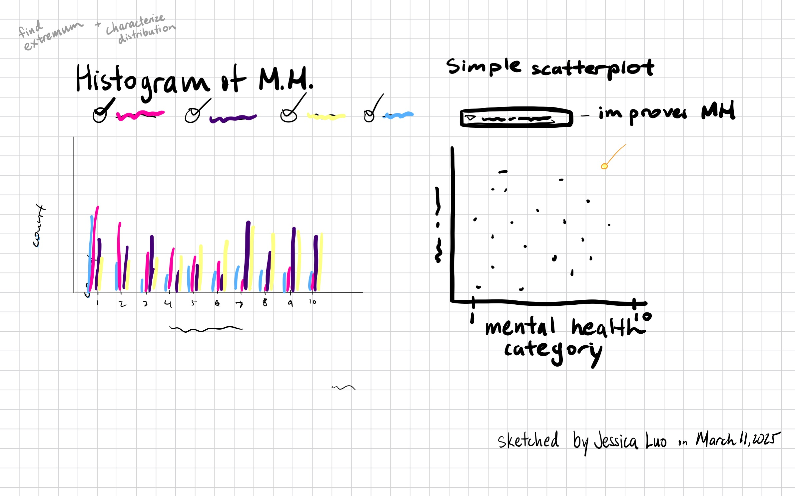
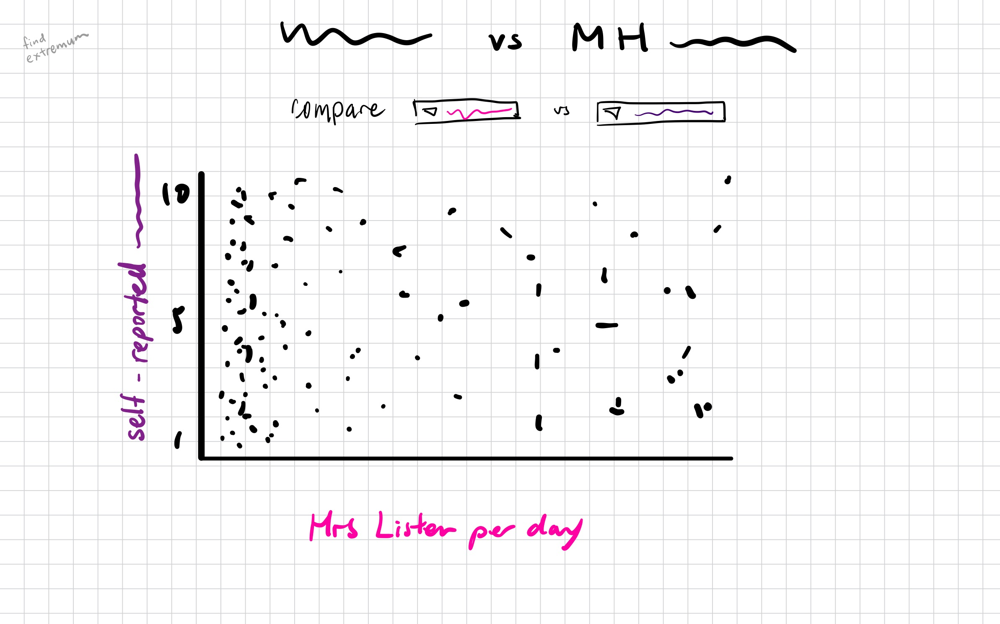
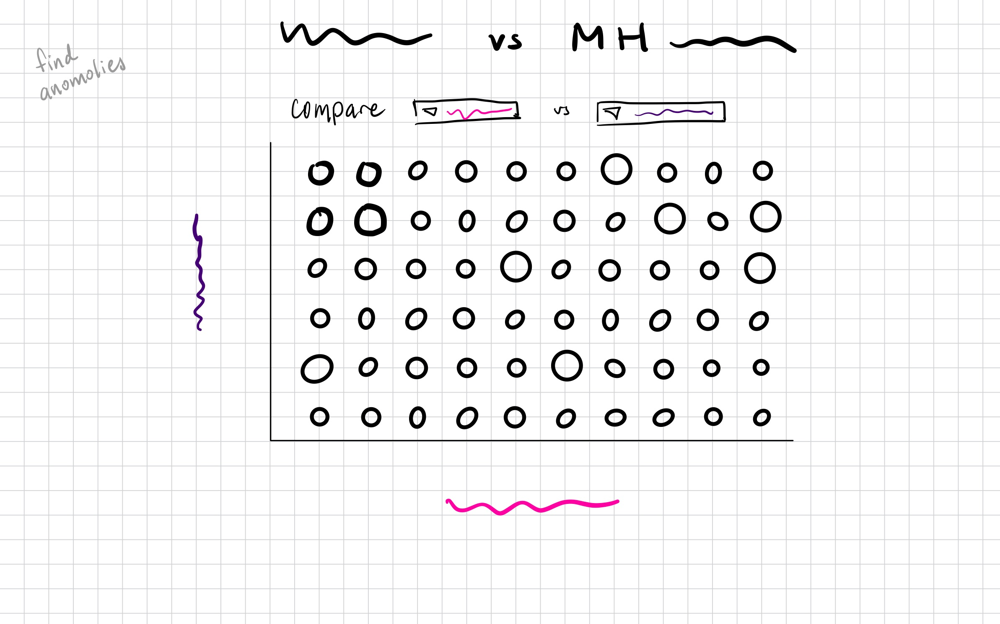
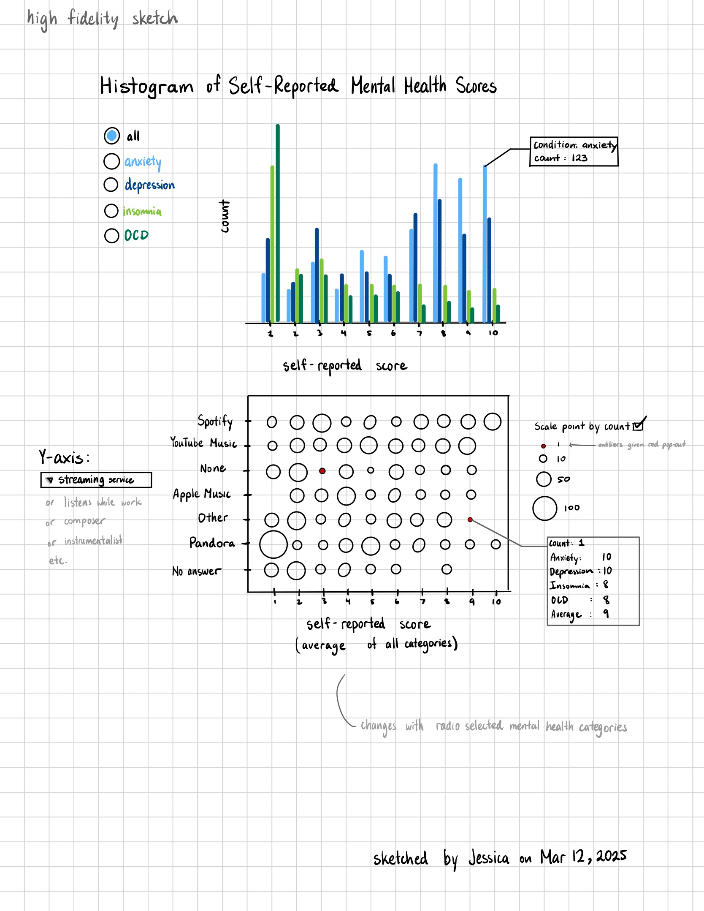
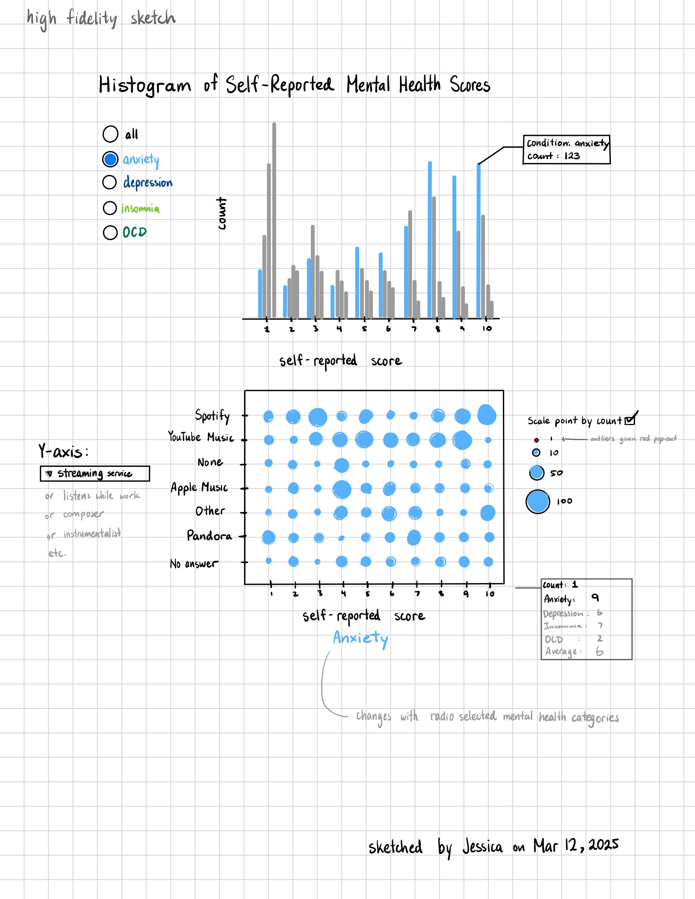

## Introduction
The [Music & Mental Health Survey Dataset](https://www.kaggle.com/datasets/catherinerasgaitis/mxmh-survey-results/data) comes from Kaggle and was compiled by Catherine Rasgaitis based on a survey about music-listening habits and their connection to mental health that respondents filled out via Google Forms. The form was posted on different social media platforms such as Reddit and Discord. The dataset has a CC0: Public Domain license and consists of 737 rows and 33 columns.

Our team is FabFour, consisting of Allison Fellhauer, Olena Sokolovska, Judy Lee, and Jessica Luo. 

Allison is currently a Bachelor of Computer Science (BCS) student interested in machine learning, data science, and artificial intelligence. Coming from a background in biology with a minor in psychology, she has a strong foundation in cognition and positive psychology—both of which explored the positive impact of music on mental health.  Her interest in the Music and Mental Health dataset stems from her passion for understanding how music influences emotional well-being and how it can uplift individuals from languishing to flourishing.

Judy is a 5th-year computer science major and data science minor with a background in product design (UX/UI). She is particularly drawn to the music and mental health survey dataset because it combines two of her passions: music and mental health. As someone who is often found listening to music, Judy has a personal connection to how it can influence emotions and well-being. The dataset resonates with her as it provides an opportunity to explore how music impacts mental health and analyze the data to uncover meaningful insights.

As a Behavioural Neuroscience student, Jessica is interested in any topic in the area of mental health. She grew up with music as a core component of life and appreciates the diversity of benefits that many people can obtain from listening, making and appreciating music. When Jessica was a Crisis Line Volunteer supporting callers with mental health challenges, she heard from many help-seekers that music was something people turned to when they felt anxious, stressed, depressed, restless or lonely.

Our intended audience includes individuals who are passionate about music or mental health, such as music enthusiasts, mental health professionals, and researchers interested in the intersection of the two fields. Since this dataset allows for the visual exploration of how different music genres correlate with mental health conditions like anxiety and depression, we aim to provide valuable insights through data visualizations. These insights will help people better understand how music influences emotional well-being and overall mental health.

## About the Data (no limit)

### Data Abstraction
| Attribute Name            | Attribute Type   | Data Semantics                                                    | Cardinality        |
|---------------------------|------------------|-------------------------------------------------------------------|--------------------|
| Timestamp                 | Temporal | The date and time when the survey form was submitted.           | 717                |
| Age                       | Quantitative     | The age of the respondent.                  | 10-89              |
| Primary streaming service | Categorical      | The primary streaming service used by the respondent.             | 6                  |
| Hours per day             | Quantitative     | The number of hours the individual listens to music per day.      | 0-24               |
| While working             | Categorical      | Whether the individual listens to music while working | 2              |
| Instrumentalist           | Categorical      | Whether the individual plays an instrument      | 2                  |
| Composer                  | Categorical      | Whether the individual is a composer           | 2                  |
| Fav genre                 | Categorical      | The favorite genre of music of the respondent.                    | 16                 |
| Exploratory               | Categorical      | Whether the individual is exploratory in terms of music genres  | 2            |
| Foreign Languages         | Categorical      | Whether the individual listens to music in foreign languages  | 2              |
| BPM                       | Quantitative     | Beats per minute of favorite genre      | 0 - 999999999      |
| Frequency [Fav genre]     | Ordinal          | How frequently the respondent listens to [Fav genre] music. | 4 each            |
| Anxiety                   | Ordinal          | Self-reported anxiety on a scale of 0-10. | 11             |
| Depression                | Ordinal          | Self-reported depression on a scale of 0-10.               | 11                 |
| Insomnia                  | Ordinal          | Self-reported insomnia on a scale of 0-10.                  | 11                 |
| OCD                       | Ordinal          | Self-reported OCD on a scale of 0-10.                      | 11                 |
| Music effects             | Ordinal          | The effect that music has on the respondent's mental health conditions?          | 3                  |
| Permissions               | Categorical      | Permission to publicize data | 1

### Exploratory Data Analysis
All four of our group's invidiual exploratory data analysis can be found under the analysis folder. We shall present the key findings in the notebook labeled "EDA Summary" located in the analysis folder.

## Research Questions (~500 words)

Jessica's research question is, 
**"How does response bias play a role in self-reporting mental health severity?"** Further questions worth exploring might be:
*"What are the patterns and anomalies in self-reported mental health severities?",
"How do demographics (eg. mental illness), music listening habits contribute to biased self-reporting?",
"Are there any reasons for extreme/invalid response values that can be identified based on other responses?",
"How do illogical, invalid responses influence data reliability?"*
The visualization may be a dashboard with interactions, or SPLOM with outlier points that are linked bi-directionally to other visualizations.

## Task Analysis (~500 words)

**Characterize Distribution - What is the distribution of self-reported mental health scores in those who believe music does not improve mental health?**
  - Distributions could be different for those who believe music does vs does not improve mental health.

**Find Extremum - "What are the most and least frequently reported mental health severity scores?"**
  - Most frequent reported mental health severity scores might reflect response biases.

**Cluster – Can we group individuals into clusters based on their music preferences and mental health scores?**
  - Clusters of groups may be indicative of relationships.

**Find Anomalies - "Are there outliers in the self-reported mental health severities that suggest response bias or survey trolls?" (e.g. 1/10 for insomnia but 10/10 for OCD; 1/10 anxiety but 10/10 for depression, OCD and insomnia)**
  - Invalid or illogical responses could indicate issues regarding misinterpretation of survey questions, problems with self-response surveys, and/or presence of "trolls".

## Preliminary Sketches (~250 words)

### Jessica's Sketches

**Characterize Distribution - What is the distribution of self-reported mental health scores in those who believe music does not improve mental health?**

This sketch of a violin plot may effectively show distributions of each mental health category. Separating by colors allows viewers to easily distinguish between the different categories, but is potentially unnecessary. The bar graph in black may be useful for identifying the medians and IQR. The tool-tip makes it easy for a viewer to retrieve an exact value (for a different task), but may not be good at looking at an overview of the variables shown by the tool-tip.

**Find Extremum - "What are the most and least frequently reported mental health severity scores?"**

This sketch effectively conveys exploratory data insights through a histogram and a scatterplot, both of which align with the task of finding extremums (and characterizing distributions). The grouped bar chart/histogram would provide a a clear breakdown of mental health scores, but the colors could be changed to be made colorblind friendly. The scatterplot offers insight into how mental health categories distribute, but the panel may be better separated so the viewer understands that the right and left panels are separate.

**Cluster – Can we group individuals into clusters based on their music preferences and mental health scores?**

This sketch conveys a comparison between music listening habits (e.g. hrs per day) and self-reported mental health, with a scatterplot representing the relationship. However, the filtering options (under the title) could be clearer. The axes labels could be more specific — "Hours Listen per Day" should specify that it's total number of hours. To improve readability, adding shaded areas, colours or density representations would help reveal cluster patterns in the data more effectively.

**Find Anomalies - "Are there outliers in the self-reported mental health severities that suggest response bias or survey trolls?" (e.g. 1/10 for insomnia but 10/10 for OCD; 1/10 anxiety but 10/10 for depression, OCD and insomnia)**

The plot comparing one nominal mental health variable (e.g. anxiety) vs another mental health variable (e.g. OCD) may be interesting and effective at identifying outliers, such as people with low anxiety and high OCD (since [OCD is an anxiety disorder](https://www.hopkinsmedicine.org/health/conditions-and-diseases/obsessivecompulsive-disorder-ocd)). This sketch does not have a legend for size of circles, which should be added to improve expressiveness. However, area is known to have poor effectiveness when it comes to human visualization.

**High Fidelity Sketch**

My high fidelity sketch adheres to the principles of visual design we learnt in class by using a histogram to express self-reported mental health scores and effectively communicate the distributions of each score. The vis ensures discriminability through distinct, color blind friendly colors for different conditions. Highlighting 1 of 1 points in red helps to draw attention to outliers (pop-out). Keeping the same X axis for both graphs helps create uniformity. The potential to use closure with a brush tool could help enhance understanding and interactivity.

## Next Steps (~250 words)

To achieve an A-grade project, our group will follow the structured timeline (below).
The plan is broken down into actionable steps with deadlines and assigned responsibilities.

Proposed timeline:
| Task                                              | Date                  | Assignee               |
|---------------------------------------------------|-----------------------|------------------------|
| Implement feedback from PM2                       | ASAP                  | Applicable members     |
| Attend OH for advice for A+ project               | Wed Mar 12, 12:30-2pm | ???                    |
| Create 1st visualizations                         | Fri Mar 14            | all                    |
| Check-in Discord Meeting                          | Fri Mar 14, evening   | all                    |
| Create 2nd visualizations                         | Sat Mar 15            | all                    |
| Create 3rd & 4th visualization(s)                 | Sun Mar 16            | all                    |
| Attend OH for advice for A+ project               | Wed Mar 19, 12:30-2pm | ???                    |
| Check-in Discord Meeting                          | Wed Mar 19, evening   | all                    |
| Finalize individual vis + written sections        | Wed Mar 19            | all                    |
| look over/give feedback to team member's vis      | Fri Mar 21            | all                    |
| adjust vis based on feedback (if needed)          | Sat Mar 22            | all                    |
| Finalize contracted grade                         | Sun Mar 23            | all                    |
| Create and publish website                        | Sun Mar 23            | Jess                   |

In addition, each group member will adhere to the following:
- Version Control: All members will commit their work to GitHub with clear commit messages and create separate Pull Requests when making changes based on TA feedback.
- Project Management: all members will write their completed tasks/actions as a comment under the respective issue(s).
- Feedback Incorporation: Regular communication on Discord, to ensure alignment and quality.

