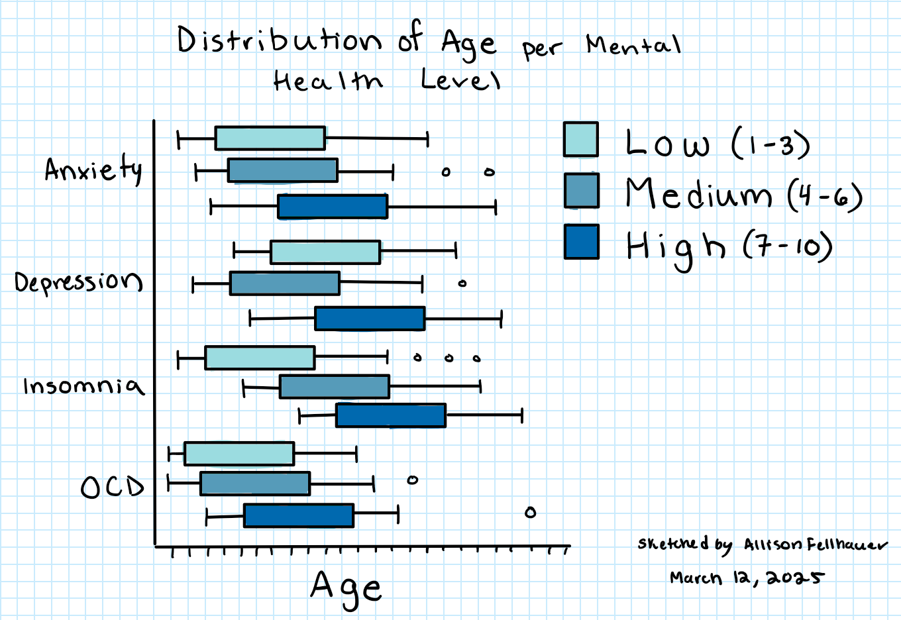
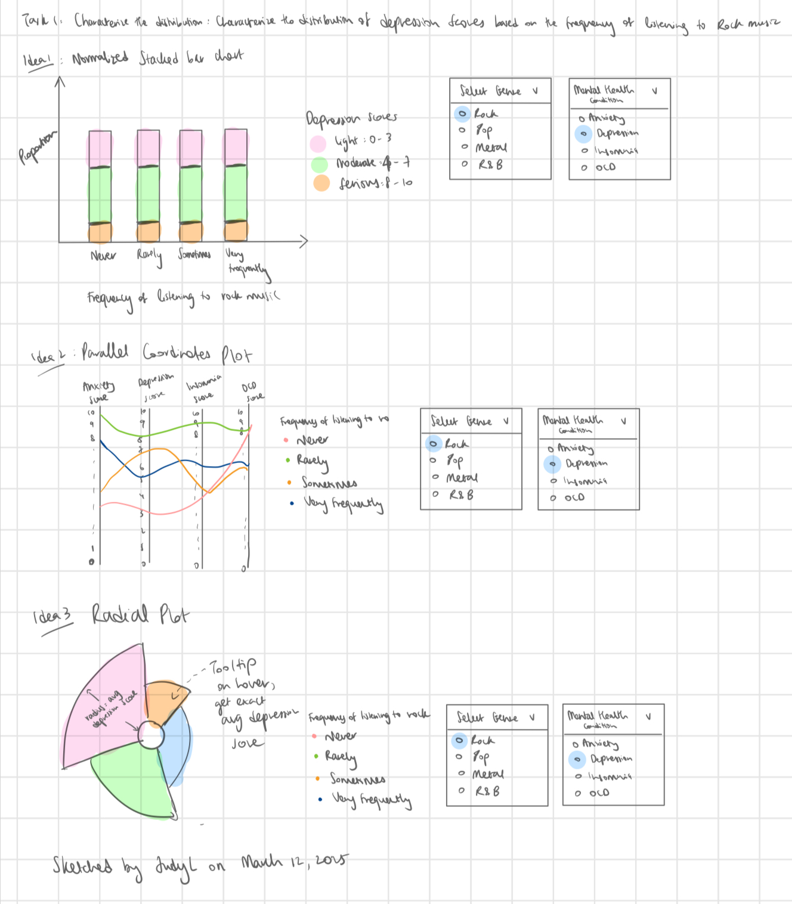
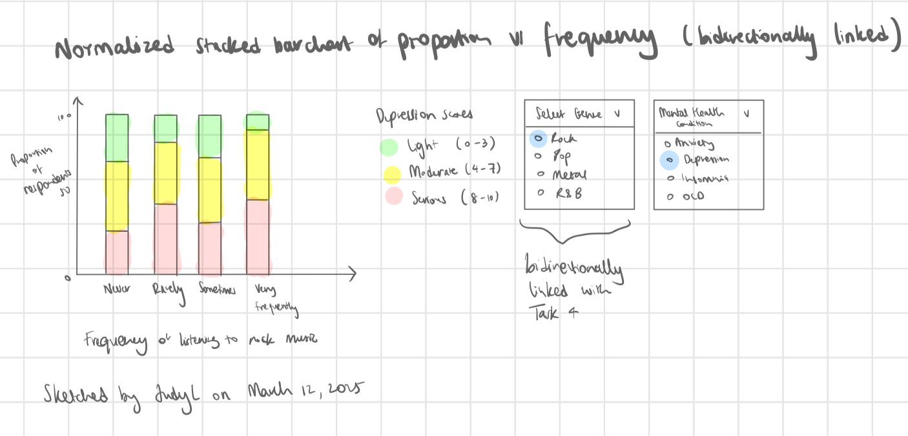
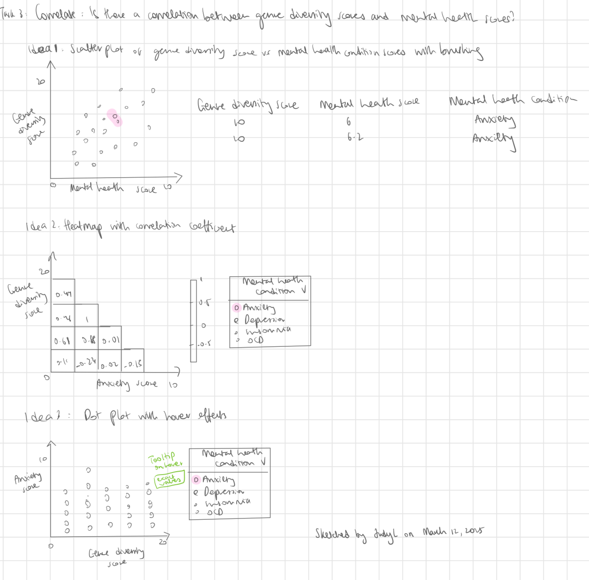
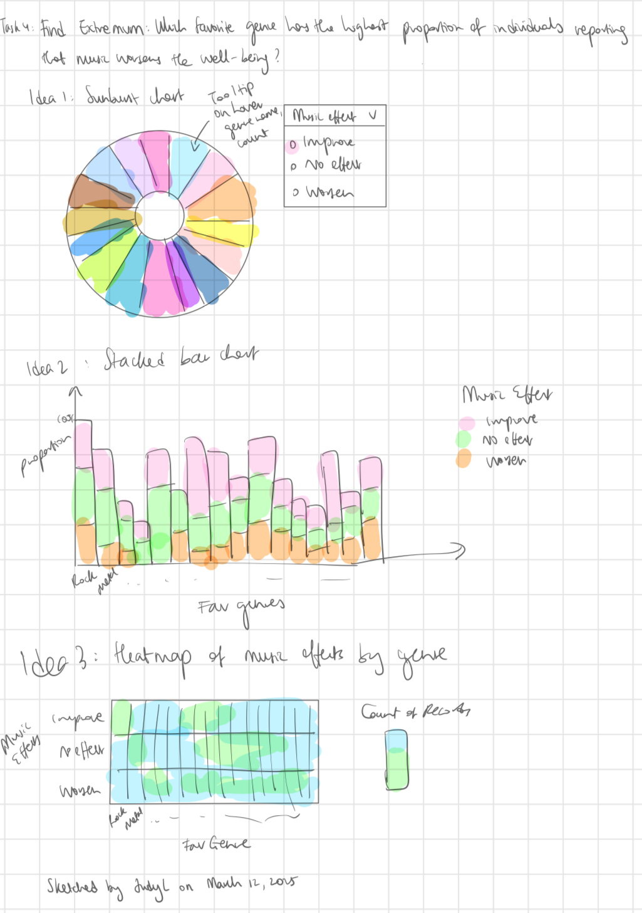

## Introduction
The [Music & Mental Health Survey Dataset](https://www.kaggle.com/datasets/catherinerasgaitis/mxmh-survey-results/data) comes from Kaggle and was compiled by Catherine Rasgaitis based on a survey about music-listening habits and their connection to mental health that respondents filled out via Google Forms. The form was posted on different social media platforms such as Reddit and Discord. The dataset has a CC0: Public Domain license and consists of 737 rows and 33 columns.

Our team is FabFour, consisting of Allison Fellhauer, Olena Sokolovska, Judy Lee, and Jessica Luo. 

Allison is currently a Bachelor of Computer Science (BCS) student interested in machine learning, data science, and artificial intelligence. Coming from a background in biology with a minor in psychology, she has a strong foundation in cognition and positive psychology—both of which explored the positive impact of music on mental health.  Her interest in the Music and Mental Health dataset stems from her passion for understanding how music influences emotional well-being and how it can uplift individuals from languishing to flourishing.

Judy is a 5th-year computer science major and data science minor with a background in product design (UX/UI). She is particularly drawn to the music and mental health survey dataset because it combines two of her passions: music and mental health. As someone who is often found listening to music, Judy has a personal connection to how it can influence emotions and well-being. The dataset resonates with her as it provides an opportunity to explore how music impacts mental health and analyze the data to uncover meaningful insights.

As a Behavioural Neuroscience student, Jessica is interested in any topic in the area of mental health. She grew up with music as a core component of life and appreciates the diversity of benefits that many people can obtain from listening, making and appreciating music. When Jessica was a Crisis Line Volunteer supporting callers with mental health challenges, she heard from many help-seekers that music was something people turned to when they felt anxious, stressed, depressed, restless or lonely.

Our intended audience includes individuals who are passionate about music or mental health, such as music enthusiasts, mental health professionals, and researchers interested in the intersection of the two fields. Since this dataset allows for the visual exploration of how different music genres correlate with mental health conditions like anxiety and depression, we aim to provide valuable insights through data visualizations. These insights will help people better understand how music influences emotional well-being and overall mental health.

## About the Data (no limit)

### Data Abstraction
| Attribute Name            | Attribute Type   | Data Semantics                                                    | Cardinality        |
|---------------------------|------------------|-------------------------------------------------------------------|--------------------|
| Timestamp                 | Temporal | The date and time when the survey form was submitted.           | 717                |
| Age                       | Quantitative     | The age of the respondent.                  | 10-89              |
| Primary streaming service | Categorical      | The primary streaming service used by the respondent.             | 6                  |
| Hours per day             | Quantitative     | The number of hours the individual listens to music per day.      | 0-24               |
| While working             | Categorical      | Whether the individual listens to music while working | 2              |
| Instrumentalist           | Categorical      | Whether the individual plays an instrument      | 2                  |
| Composer                  | Categorical      | Whether the individual is a composer           | 2                  |
| Fav genre                 | Categorical      | The favorite genre of music of the respondent.                    | 16                 |
| Exploratory               | Categorical      | Whether the individual is exploratory in terms of music genres  | 2            |
| Foreign Languages         | Categorical      | Whether the individual listens to music in foreign languages  | 2              |
| BPM                       | Quantitative     | Beats per minute of favorite genre      | 0 - 999999999      |
| Frequency [Fav genre]     | Ordinal          | How frequently the respondent listens to [Fav genre] music. | 4 each            |
| Anxiety                   | Ordinal          | Self-reported anxiety on a scale of 0-10. | 11             |
| Depression                | Ordinal          | Self-reported depression on a scale of 0-10.               | 11                 |
| Insomnia                  | Ordinal          | Self-reported insomnia on a scale of 0-10.                  | 11                 |
| OCD                       | Ordinal          | Self-reported OCD on a scale of 0-10.                      | 11                 |
| Music effects             | Ordinal          | The effect that music has on the respondent's mental health conditions?          | 3                  |
| Permissions               | Categorical      | Permission to publicize data | 1

### Exploratory Data Analysis
All four of our group's invidiual exploratory data analysis can be found under the analysis folder. We shall present the key findings in the notebook labeled "EDA Summary" located in the analysis folder.

## Research Questions (~500 words)

Jessica's research question is, 
**"How does response bias play a role in self-reporting mental health severity?"** Further questions worth exploring might be:
*"What are the patterns and anomalies in self-reported mental health severities?",
"How do demographics (eg. mental illness), music listening habits contribute to biased self-reporting?",
"Are there any reasons for extreme/invalid response values that can be identified based on other responses?",
"How do illogical, invalid responses influence data reliability?"*
The visualization may be a dashboard with interactions, or SPLOM with outlier points that are linked bi-directionally to other visualizations.

## Task Analysis (~500 words)

**Characterize Distribution - What is the distribution of self-reported mental health scores in those who believe music does not improve mental health?**
  - Distributions could be different for those who believe music does vs does not improve mental health.

**Find Extremum - "What are the most and least frequently reported mental health severity scores?"**
  - Most frequent reported mental health severity scores might reflect response biases.

**Cluster – Can we group individuals into clusters based on their music preferences and mental health scores?**
  - Clusters of groups may be indicative of relationships.

**Find Anomalies - "Are there outliers in the self-reported mental health severities that suggest response bias or survey trolls?" (e.g. 1/10 for insomnia but 10/10 for OCD; 1/10 anxiety but 10/10 for depression, OCD and insomnia)**
  - Invalid or illogical responses could indicate issues regarding misinterpretation of survey questions, problems with self-response surveys, and/or presence of "trolls".

## Preliminary Sketches (~250 words)

### Jessica's Sketches

**Characterize Distribution - What is the distribution of self-reported mental health scores in those who believe music does not improve mental health?**

This sketch of a violin plot may effectively show distributions of each mental health category. Separating by colors allows viewers to easily distinguish between the different categories, but is potentially unnecessary. The bar graph in black may be useful for identifying the medians and IQR. The tool-tip makes it easy for a viewer to retrieve an exact value (for a different task), but may not be good at looking at an overview of the variables shown by the tool-tip.

**Find Extremum - "What are the most and least frequently reported mental health severity scores?"**

This sketch effectively conveys exploratory data insights through a histogram and a scatterplot, both of which align with the task of finding extremums (and characterizing distributions). The grouped bar chart/histogram would provide a a clear breakdown of mental health scores, but the colors could be changed to be made colorblind friendly. The scatterplot offers insight into how mental health categories distribute, but the panel may be better separated so the viewer understands that the right and left panels are separate.

**Cluster – Can we group individuals into clusters based on their music preferences and mental health scores?**

This sketch conveys a comparison between music listening habits (e.g. hrs per day) and self-reported mental health, with a scatterplot representing the relationship. However, the filtering options (under the title) could be clearer. The axes labels could be more specific — "Hours Listen per Day" should specify that it's total number of hours. To improve readability, adding shaded areas, colours or density representations would help reveal cluster patterns in the data more effectively.

**Find Anomalies - "Are there outliers in the self-reported mental health severities that suggest response bias or survey trolls?" (e.g. 1/10 for insomnia but 10/10 for OCD; 1/10 anxiety but 10/10 for depression, OCD and insomnia)**

The plot comparing one nominal mental health variable (e.g. anxiety) vs another mental health variable (e.g. OCD) may be interesting and effective at identifying outliers, such as people with low anxiety and high OCD (since [OCD is an anxiety disorder](https://www.hopkinsmedicine.org/health/conditions-and-diseases/obsessivecompulsive-disorder-ocd)). This sketch does not have a legend for size of circles, which should be added to improve expressiveness. However, area is known to have poor effectiveness when it comes to human visualization.

**High Fidelity Sketch**

My high fidelity sketch adheres to the principles of visual design we learnt in class by using a histogram to express self-reported mental health scores and effectively communicate the distributions of each score. The vis ensures discriminability through distinct, color blind friendly colors for different conditions. Highlighting 1 of 1 points in red helps to draw attention to outliers (pop-out). Keeping the same X axis for both graphs helps create uniformity. The potential to use closure with a brush tool could help enhance understanding and interactivity.

### Allison's Sketches
**Retrieve value: What is the most commonly reported favourite genre for specific age groups**

The three low fidelity sketches for task 1 above are as follows: 
1) A bar chart of genres sorted by count and a radio button to swap between age groups
2) A mosaic plot of different genres for each age group
3) A pie chart showing the top four genres with a radio button to swap between age groups.

The first option uses the common length channel (on a common scale) to display the magnitude, which is preferred over 2) and 3), which both use area (2D size). The use of these channels are effective, but using a common scale is the strongest at conveying the magnitude. The use of the radio button in 2) and 3) provides interaction, which 2) lacks. A major limitation of 2) and 3) are their ability to display all distinct categories satisfactorily. For 2), colour is needed to distinguish between groups, however, it is challenging to use 16 distinct colours. For 3), the area on a pie chart is limited and will be challenging to separate from each other. In this example, I only chose the top-four, which comes with the downside of not being able to display all categories at one.

**High Fidelity Sketch**

**Compute derived value: What is the average age associated with each favourite genre?**

The three low fidelity sketches for task 2 above are as follows: 
1) A bubble chart with interactability and a tooltip displaying the aggregated value.
2) Unidirectionally linked bar charts (left: genre sorted by average age; right: distribution of age)
3) A heatmap of the distribution with a tooltip displaying average age.

The first option (1) uses area to encode the magnitude property (number of respondants) and a tooltip to display the aggregation (average age) for each genre. (2) uses linked bar charts using the length on a common scale channel to encode magnitude. The user would click on the bar of a genre, which would display the corresponding dsitribution of values. (3) uses the colour saturation channel to display mangitude (count) and a tooltip to display the aggregated value (average age). 2) ranks the highest for accuracy/effectiveness, as using a common scale is the preferred channel for ordered attributes. 1) has the issue of using the area of a circle to encode magnitude, which does not grow at a consistent rate. In addition, the size of the circle will be quite small for smaller categories, since some genres have very few respondants (e.g. only 2 for latin). The heat map suffers from the issue of using color saturation to encode magnitude, which can be difficult to interpret accurately, especially for subtle differences. Additionally, without clear numerical labels, viewers may struggle to precisely compare values across the heatmap. While tooltips provide additional context, they require interaction and do not offer an at-a-glance summary of the data.

**High Fidelity Sketch**

**Determine range: Find range of ages reporting high mental health scores for each condition**

The three low fidelity sketches for task 3 above are as follows:
1) A box plot of age distributions for each condition (Anxiety, Depression, Insomnia, OCD).
2) A stacked bar chart showing the count of high mental health scores across age ranges.
3) A violin plot representing the distribution density of ages for each condition.

The box plot (1) uses position along a common scale to encode age and length of the box and whiskers to represent the range of ages reporting high mental health scores. Outliers are explicitly marked, making it easy to identify extreme values. The stacked bar chart (2) encodes magnitude using bar height and color hue to distinguish between mental health conditions. While effective for comparing relative frequencies across age groups, it does not directly highlight the range of ages in each condition. The violin plot (3) encodes distribution density through area and uses position on a common scale to represent age, making it useful for identifying if there are multiple peaks but less precise for pinpointing specific age ranges. 1) ranks highest in accuracy, as it clearly displays the minimum, maximum, and interquartile ranges, which directly answer the task (find the range). 

**High Fidelity Sketch**

### Judy's Sketches

**Characterize distribution: What is the distribution of depression scores based on the frequency of listening to Rock music?**

The three low-fidelity sketches for task 1 are as follows:
- A normalized stacked bar chart showing the distribution of depression scores based on the frequency of listening to Rock music.
- A parallel coordinates plot showing the distribution of depression scores based on the frequency of listening to Rock music.
- A radial plot showing the distribution of depression scores based on the frequency of listening to Rock music.

*Critique*
1) Normalized Stacked Bar Chart
   
- Encoding: The normalized stacked bar chart uses position on a common scale, which is one of the most effective visual channels for accurately comparing magnitudes. Since we aim to represent proportions, the bars are normalized (stacked to 100%) to facilitate part-to-whole comparisons across different frequency categories. The color encoding is used to differentiate between depression score categories, improving discriminability while maintaining clear segment boundaries.
- Expressiveness: The visualization adheres to the expressiveness principle, as all encoded attributes (position, color) directly correspond to the dataset’s characteristics without unnecessary information.
- Effectiveness: Position encoding makes the relative distribution easy to compare across groups. 
- Interactivity: A UI widget with filter dropdowns enables users to select different genres and mental health conditions (e.g., anxiety, depression, insomnia, OCD), increasing flexibility in data exploration.
  
2) Parallel Coordinates Plot
   
- Encoding: The parallel coordinates plot places mental health conditions (e.g., depression, anxiety) along parallel axes, with lines connecting values across dimensions. Position on a common scale is used to compare depression scores, while color encoding distinguishes between different frequency categories of listening to Rock music.
- Expressiveness: The plot maintains expressiveness since all visual encodings directly represent the dataset’s attributes.
- Effectiveness: While parallel coordinate plots are excellent for showing multidimensional relationships, they suffer from overplotting and clutter when too many data points are present, making it harder to discern trends in large datasets.
- Interactivity: Filter dropdowns allow users to highlight specific genres or conditions, but without interaction, the visualization may become difficult to interpret.

3) Radial Plot
   
- Encoding: A radial layout (polar coordinates) is used, where angular position represents the frequency of listening to Rock music and radial distance encodes depression scores. Color differentiates listening frequency categories and shows good discriminability. Size encodes the average depression score per frequency category.
- Expressiveness: The plot maintains expressiveness since all visual encodings directly represent the data attributes. The encoding remains relevant, though polar plots can introduce distortions in perception, particularly for angular comparisons which are harder to judge accurately than linear ones.
- Effectiveness: While visually engaging, the plot can be difficult to gauge angles clearly, making direct comparisons less effective than in Cartesian plots.
- Interactivity: A tooltip provides exact depression score values when hovering, and filter dropdowns allow users to switch between mental health conditions.

**High Fidelity Sketch**

I chose the normalized stacked bar chart as the final high-fidelity design because it offers the best balance of expressiveness and effectiveness for this task.
- Position on a common scale is the most accurate visual channel for magnitude comparisons.
- Stacking preserves part-to-whole relationships, making it easier to compare proportions than in radial or parallel plots.
- Color encoding enhances differentiation between depression score categories without introducing unnecessary complexity.
- Dropdown filters allow users to explore other genres and mental health conditions, increasing flexibility.
- Cognitive load is lower compared to parallel coordinates and radial plots, making interpretation intuitive.

**Determine Range: What is the range of genre diversity scores among individuals who report that music improves their well-being?**

The three low-fidelity sketches for task 2 are as follows:

- Histogram of genre diversity scores, showing the distribution of scores, where we can filter by music effect (Improve, Worsen, No Effect).
- Boxplot of genre diversity scores, showing the spread and summary statistics of scores, where we can filter by music effect.
- Violin plot of genre diversity scores, showing both distribution and density, where we can filter by music effect and use a range slider to select a subset of scores.

*Critique*

1) Histogram

- Encoding: The histogram uses position on a common scale (vertical for frequency and horizontal for genre diversity scores), which is highly effective for showing distributions and identifying the shape of data (e.g., normal, skewed, multimodal).
- Expressiveness: The visualization remains expressive since it directly represents the data characteristics without unnecessary elements.
- Effectiveness: It provides an intuitive view of frequency distributions but does not explicitly show measures like quartiles, outliers, or central tendency (which a boxplot or violin plot can).
Filtering via a dropdown enables users to compare distributions across music effect categories, though comparisons might require flipping between views.
- Limitations: Bin size selection can impact interpretability. It is also harder to make direct comparisons between categories unless displayed side by side.

2) Boxplot
- Encoding: The boxplot also uses position on a common scale, but instead of showing full distributions, it summarizes the data via quartiles, median, whiskers, and outliers.
- Expressiveness: It adheres to expressiveness principles by accurately depicting range, central tendency, and spread without unnecessary complexity. Filtering via a dropdown selector enables users to view different music effect groups.
- Effectiveness: Great for comparing summary statistics but hides detailed distribution patterns (e.g., modality, density of values). Outliers are clearly visible, which helps in identifying unusual values. It is also more compact than a histogram, making it suitable for side-by-side comparisons.
- Limitations: It does not show the actual shape of the distribution. It might be harder for non-expert users to interpret compared to a histogram.

3) Violin Plot
- Encoding: Like the boxplot, the violin plot uses position on a common scale, but instead of summarizing distribution with quartiles alone, it also shows density estimation on each side of the "violin."
- Expressiveness: he visualization adheres to the expressiveness principle, as all encoded attributes (position, color) directly correspond to the data characteristics without unnecessary information. It is also expressive since it displays both distribution shape and statistical summaries. The interactive legend allows users to toggle different music effect categories (Improve, Worsen, No Effect, or all three simultaneously), which allows for easier comparisons to be made.
- Effectiveness: It combines the strengths of boxplots (summary statistics) and histograms (distribution density). It is also more compact and interpretable than multiple histograms, making it easier to compare distributions. The UI widget (range slider) allows users to focus on specific genre diversity score ranges, thus improving data exploration.
- Limitation: The density estimation is based on kernel smoothing, which can sometimes misrepresent sparse data. 

**High Fidelity Sketch**

I chose the violin plot for the high-fidelity sketch because it provides the best balance of expressiveness and effectiveness:
- It combines summary statistics and distribution density, making it more informative than a boxplot or histogram alone.
- It is more compact than multiple histograms, allowing direct comparisons between music effect categories.
- The interactive legend enables switching between individual and combined views of different categories.
- The range slider provides an additional level of interactivity, letting users focus on specific score ranges.
- It is easy for users to understand and compare distributions.

**Correlate: Is there a correlation between genre diversity scores and self-reported mental health scores?**

The three low-fidelity sketches for Task 3 are as follows:

- Scatterplot of genre diversity scores and mental health condition scores, with brushing interaction that displays a table containing detailed values.
- Heatmap with correlation coefficients, featuring a filter dropdown to select which mental health condition score to display.
- Dot plot with hover effects, where a filter dropdown allows users to select the mental health condition score of interest.

*Critique*

1) Scatterplot

- Encoding: Uses position on a common scale, where the vertical axis represents genre diversity scores and the horizontal axis represents mental health scores.
- Expressiveness: The scatterplot effectively shows relationships between two continuous variables, making it a good method for correlation analysis. The brushing interaction enhances clarity by allowing users to examine specific data points in greater detail.
- Effectiveness: The visualization adheres to the expressiveness principle, as all encoded attributes (position, color) directly correspond to the data characteristics without unnecessary information. It provides an intuitive way to assess trends, clusters, and potential outliers. The brushing interaction also reveals additional details in a table, helping users interpret individual data points. it is well-suited for understanding how genre diversity relates to mental health conditions.
- Limitations: It can become cluttered if there are too many data points and the correlation trends may not be immediately clear without additional visual aids like trend lines.

2) Heatmap

- Encoding: Uses area (2D) encoding with shared boundaries, and color encoding to represent correlation strength. A filter dropdown allows selection of different mental health condition scores.
- Expressiveness: The visualization adheres to the expressiveness principle, as all encoded attributes (position, color) directly correspond to the data characteristics without unnecessary information. It clearly communicates correlation values, as colors make it easy to differentiate strong vs. weak correlations.
- Effectiveness: It quickly conveys overall trends and relationships in a compact space and users can easily compare different mental health condition scores via the filter dropdown. It is also suitable for detecting strong or weak correlations at a glance.
- Limitations: It is less effective for detailed individual data exploration and can be misleading if small differences in correlation may not be easily differentiated due to color gradients.
  
3) Dot Plot

- Encoding: Uses position on a common scale (vertical for genre diversity scores, horizontal for mental health scores), with hover interactions to show exact values. A filter dropdown allows selecting the mental health condition score.
- Expressiveness: Clearly presents individual data points while reducing clutter compared to a scatterplot.
- Effectiveness: It simplifies the visualization by making each data point distinct. The hover interactions allow users to see exact values without overwhelming the visualization and the filtering improves clarity by focusing on specific mental health conditions.
- Limitations: It lacks trend lines or density representation, making the overall correlation patterns harder to interpret. It can become difficult to read if there are too many overlapping points.

**High Fidelity Sketch**

I chose the scatterplot for the high-fidelity sketch because it provides the best balance of expressiveness and effectiveness as:
- It directly visualizes relationships between genre diversity and mental health scores.
- The brushing interaction allows deeper exploration of specific data points.
- It supports identification of outliers and patterns that might be lost in an aggregate view like a heatmap.
- It provides a strong visual representation of correlation.

**Find Extremum: Which favorite genre has the highest proportion of individuals reporting that music worsens their well-being?**

The three low-fidelity sketches for Task 4 are as follows:

- Sunburst Chart showing the breakdown of favorite genres, using color and size to encode proportions, with a filter dropdown for music effect.
- Normalized Stacked Bar Chart displaying the proportion of individuals by favorite genre and self-reported music effect.
- Heatmap representing music effect by favorite genre, where color encodes the proportion of individuals.

*Critique*
1) Sunburst Chart

- Encoding: Uses polar position encoding (angular position for genres and radial distance for proportions), with color distinguishing different genres.
- Expressiveness: The visualization adheres to the expressiveness principle, as all encoded attributes (position, color) directly correspond to the data characteristics without unnecessary information.It also shows hierarchical relationships and proportions using the magnitude channels.
- Effectiveness: It captures the distribution of individuals reporting negative effects across different genres. The filter dropdown also allows users to focus on specific music effect categories. It is also effective as it also has hover tooltips display genre name, count, and proportion, enhancing data accessibility.
- Limitations: It can become cluttered with too many categories and it is not ideal for precise comparisons between genre proportions.

2) Stacked Bar Chart

- Encoding: Uses position on a common scale, with bars representing favorite genres and segments within each bar showing proportions of self-reported music effects.
- Expressiveness: The visualization adheres to the expressiveness principle, as all encoded attributes (position, color) directly correspond to the data characteristics without unnecessary information. It clearly displays the proportion of individuals reporting negative effects for each genre.
- Effectiveness: It allows easy comparisons between genres and the normalized bar heights enable proportional comparisons, making it clear which genre has the highest proportion of individuals affected negatively. It is also simple and easy to interpret, especially for users unfamiliar with more complex visualizations.
- Limitations: It can become visually complex if there are too many genres and it is less interactive compared to the sunburst chart.

3) Heatmap

- Encoding: Uses area (2D) as encoding with shared boundaries and color encoding representing the count of individuals.
- Expressiveness: The visualization adheres to the expressiveness principle, as all encoded attributes (position, color) directly correspond to the dataset’s characteristics without unnecessary information. It shows the relationship between favorite genre and self-reported music effects.
- Effectiveness: It is easy to compare across multiple genres at once. The hover tooltips also help view the counts. 
- Limitations: It is less intuitive than bar charts or sunburst charts for understanding proportions and requires a good color scheme to ensure readability.

**High Fidelity Sketch**

I chose the sunburst chart for the high-fidelity sketch because it provides the best balance of expressiveness and effectiveness as:

- It encodes hierarchical relationships clearly and helps to contextualize how different genres contribute to self-reported negative effects.
- The color and size encodings make it easy to identify which genre has the highest proportion.
- The filter dropdown allows users to refine the visualization based on different music effects.
- Hover tooltips provide exact values without overwhelming the chart visually.

## Next Steps (~250 words)

To achieve an A-grade project, our group will follow the structured timeline (below).
The plan is broken down into actionable steps with deadlines and assigned responsibilities.

Proposed timeline:
| Task                                              | Date                  | Assignee               |
|---------------------------------------------------|-----------------------|------------------------|
| Implement feedback from PM2                       | ASAP                  | Applicable members     |
| Attend OH for advice for A+ project               | Wed Mar 12, 12:30-2pm | ???                    |
| Create 1st visualizations                         | Fri Mar 14            | all                    |
| Check-in Discord Meeting                          | Fri Mar 14, evening   | all                    |
| Create 2nd visualizations                         | Sat Mar 15            | all                    |
| Create 3rd & 4th visualization(s)                 | Sun Mar 16            | all                    |
| Attend OH for advice for A+ project               | Wed Mar 19, 12:30-2pm | ???                    |
| Check-in Discord Meeting                          | Wed Mar 19, evening   | all                    |
| Finalize individual vis + written sections        | Wed Mar 19            | all                    |
| look over/give feedback to team member's vis      | Fri Mar 21            | all                    |
| adjust vis based on feedback (if needed)          | Sat Mar 22            | all                    |
| Finalize contracted grade                         | Sun Mar 23            | all                    |
| Create and publish website                        | Sun Mar 23            | Jess                   |

In addition, each group member will adhere to the following:
- Version Control: All members will commit their work to GitHub with clear commit messages and create separate Pull Requests when making changes based on TA feedback.
- Project Management: all members will write their completed tasks/actions as a comment under the respective issue(s).
- Feedback Incorporation: Regular communication on Discord, to ensure alignment and quality.

