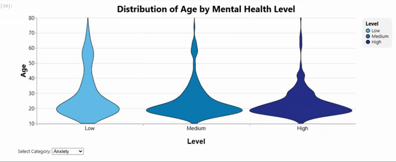
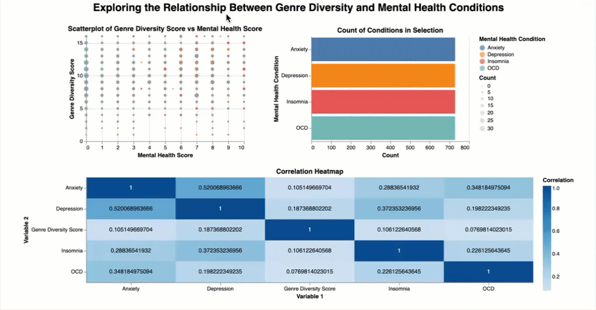

## Research Questions

*Here will we will include our research questions again:*

**Allison's** research question is: **What is the impact of the respondent's age on their survey responses?**
- Does Age Influence the Relationship Between Music Genre Preferences and Mental Health Scores? How do music preferences correlate with mental health scores for different age groups? 
- How Does Age Influence the Relationship Between Music Engagement and Mental Health Outcomes? Examine how different forms of music engagement (e.g., instrumentalist, composer) correlate with mental health outcomes across various age groups. Do those who engage with music in more dimensions (e.g. composer or musician) form distinct groups?

**Judy's** research question is: **How does the favorite genre and the diversity of music genres an individual listens to influence the perceived music effects on their well-being and their self-reported mental health conditions?**

Some sub-research questions worth exploring would be:
- Are there specific favorite genres that are more commonly associated with positive or negative perceived effects of music on well-being?
- Are individuals who listen to a variety of music genres more likely to report that music improves their well-being compared to those with low diversity, regardless of their favorite genre?
- Do individuals with different mental health conditions (anxiety, depression, insomnia, OCD) tend to have distinct music preferences?

**Helena's** research question is: **What is the relationship between specific mental illnesses and listening habits?**
- Are any mental illnesses associated with specific listening habits (specific platforms, favourite genre, listening while working, frequency of specific genres, exploratory tastes, foreign languages, etc.)?

**Jessica's** research question is: **How does response bias play a role in self-reporting mental health severity?**

Further questions worth exploring might be:
- What are the patterns and anomalies in self-reported mental health severities?
- How do demographics (eg. mental illness), music listening habits contribute to biased self-reporting?
- Are there any reasons for extreme/invalid response values that can be identified based on other responses?
- How do illogical, invalid responses influence data reliability?
The visualization may be a dashboard with interactions, or SPLOM with outlier points that are linked bi-directionally to other visualizations.

## Visualizations

### The relationship between music preferences, musical engagement, and mental health across age groups.
*Member: Allison Fellhauer*

This visual exploration aims to better understand how age and musical engagement—both passive (favourite genres) and active (playing or composing music)—relate to self-reported mental health. Each chart was designed to answer a specific question, motivated by an interest in how people experience and interact with music across different life stages and mental health conditions.

One focus was on whether age shaped musical taste, and if certain genres were more common among younger or older groups. Another key question was whether different forms of musical engagement—such as playing an instrument, composing, or simply listening—had any connection to self-reported levels of anxiety, depression, insomnia, or OCD.

#### **How does the average age of listeners vary across favorite music genres, and what does the age distribution look like for each genre?**

#### *Summary and Explanations*:
**Tasks**
This visualization supports the following tasks:

1. **Compute Derived Value** – It displays the average age of respondents for each favourite genre.
2. **Determine Range** – It reveals the distribution and variation of ages within each genre.

The dot plot on the left shows the **average age** for each genre along the x-axis, allowing for quick comparisons across genres to identify those preferred by older vs. younger individuals. Hovering over a point provides a tooltip with exact values for both average age and count.

The linked histogram on the right shows the distribution of ages for the selected genre, binned into 5-year intervals. This enables viewers to identify skewness (e.g., Latin, Gospel), spot multiple peaks, and observe the distribution of ages within genres.

**Visualization Choices**
1) Dot plot
- Mark: Point (mark_circle)
- Channels:
     - _Horizontal_: encodes average age
     - _Vertical_: encodes genre category
     - _Size_: encodes respondent count
     - _Colour (hue)_: indicates selected genre during interaction
     - _Line_: indicates the overall average
     - _Text_: indicates genre label
Justification: The point mark was chosen instead of bars since the average does not need to originate at zero and it supports effective encoding of count using size. The size channel is able to highlight genre popularity. Colour serves a supporting aesthetic role, helping users visually track the selected genre. The use of the line was also important to serve as an anchor for the points, and to show how the values did not vary too much from the overall mean. Due to the points being far from the axis, the labels were removed and placed near their corresponding point.

2) Histogram
- Mark: Bar (mark_bar)
- Channels:
     - _Horizontal_: encodes binned age (5-year intervals)
     - _Vertical_: encocdes count per bin
     - _Colour (hue)_: matches dot plot to reflect selected genre
Justification: A bar chart provides a clear, consistent representation of age distributions, and exploits the common scale to support comparison of bin heights. The consistent bin width enables easy identification of skew, peaks, and gaps.

**Interactions and Interactivity**
The visualization employs a mouseover interaction on the dot plot. When a genre is hovered over:
- The histogram updates to reflect the age distribution for that genre.
- The genre name updates dynamically in the histogram title.
- The selected genre is highlighted using colour, while others fade to gray.

In addition, the visualization also uses a radio button for specific lookup. The mouseover limits comparison between adjacent points, so having the radio button allows for swtiching between any of the genres.

This design choice avoids overwhelming the viewer with all 16 genres simultaneously and removes the need for a legend. Since there are the presence of genres with smaller counts (e.g. Latin), including tolerance in the interaction allows for easier selection. A tooltip is used for value lookup, providing exact average age and respondent count, supporting retrieval tasks.

#### *Critique of View*
This visualization is effective due to its appropriate use of marks, position channels, and interaction design. The use of a common scale in both the dot plot and the histogram enables comparison, which is one of the primary tasks of this visualization. Although the area channel is less obvious than the length channel when making comparison, its use here helps highlight the popularity of different genres, especially the extremes. This allows the viewer to immediately see that even though gospel has the greatest average age, it is as a result of few individuals choosing this genre (count = 3). In addition, colour is used in this visualization to express the transition between categories and visually links the dot plot and the histogram. Only seven, colour-blind safe colours were used overall, which reduced stimulation while still providings distinction between neighbouring categories. By faceting and filtering, only a single category is shown at once time, bypassing the need to distinguish colours. Finally, the interaction used is sophisticated (many moving parts including the genre labels, colour, histogram filtering, and title filter), yet very simple and intuitive. It allows for easy parusal and removes all clutter caused by displaying all charts simultenously.

#### **How does the age distribution vary across different severity levels of mental health conditions?**

**Tasks**
This visualization supports the following tasks:

1. **Determine Range** – Reveals the full distribution of age for each severity level (Low, Medium, High) across various mental health conditions.
2. **Retrieve Value** – Allows inspection of how age is distributed for each selected condition and severity level.
3. **Identify Trends** – Investigates whether younger individuals are more likely to report high severity scores (as observed by researchers).

The violin plot presents the smoothed distribution of age for each mental health severity level (Low, Medium, High), for a selected condition (e.g., Anxiety, Depression, etc.). Users can switch between conditions via a dropdown menu. This visualization is specifically designed to support exploration of a potential reporting bias among older individuals, who may be less likely to rate themselves as highly anxious or depressed ([source](https://pmc.ncbi.nlm.nih.gov/articles/PMC8938292/#:~:text=In%20contrast%2C%20older%20respondents%20were,%25%20CI%200.26%E2%80%930.52)). If this bias exists, it should be reflected in narrower violins for older ages in the “High” category, or in a general shift of the “High” distribution toward younger age groups.

**Visualization Choices**
- Mark: Area (mark_area with interpolate='monotone' and orient='horizontal')
- Channels:
    - _Horizontal_: encodes smoothed density of respondents (stacked center)
    - _Vertical_: encodes age
    - _Colour (saturation)_: encodes severity Level (Low, Medium, High)
    - _Column_: facets by Level
Justification: The area mark was chosen for its ability to show density smoothly, and it was preferred over a boxplot due to its ability to represent bimodal data and display trends more clearly [source](https://clauswilke.com/dataviz/boxplots-violins.html). Faceting by level allows for direct comparison of age distributions across severity categories without interference or crowding. Overlapping violins (one per level) would be visually messy and difficult to interpret. Colour saturation is used instead hue to efectively encode the ordinal variable, and the hues choses and fully distinguishable.

**Interactions and Interactivity**
The visualization introduces a dropdown menu for the mental health condition (e.g., Anxiety, Depression, etc.). Upon selection:
- The violin plots dynamically update to show the age distributions for that condition across severity levels.
- Tooltips allow for value lookup, offering precise information about the estimated age and density at any point along the violin.

This interaction is simple but effective. It avoids overloading the user with too many violins at once and allows the user to explore one condition at a time.

#### *Critique of View*
This visualization effectively reveals distribution shapes, which is essential for addressing the question of whether younger individuals report higher severity. The width of each violin at different age points represents the relative density of respondents, allowing users to assess whether high severity is concentrated among younger people. The violin plot was chosen to emphasize density, display multiple peaks, and reduce the impact of noisy outliers. By combining this mark with faceting, each severity level appears in its own column, enabling clear and uncluttered comparisons. The dropdown interaction also enhances usability by allowing side-by-side comparisons across mental health conditions without introducing visual clutter.

However, a limitation of this approach is the presence of long tails at the top of the violins, which is misleading since it suggests the presence of data where none exists ([source](https://clauswilke.com/dataviz/boxplots-violins.html)). Additionally, violin plots are generally less intuitive than histograms, which may pose a challenge for novice viewers.

#### **How do musical hobbies relate to mental health scores across age, and which are most represented within different age and score ranges?**

#### *Summary and Explanations*:
**Tasks**
This visualization supports the following tasks:
1. **Filter** – It filters by musical hobby (both, instrumentalist, composer, or neither) and mental health condition to explore associations between musical hobbies, age, and mental health scores.
2. **Retrieve Value** – It retrieves the count of respondents per musical hobbies, as well as the range and distribution of mental health scores.
3. **Determine Range** – It enables examination of score distribution across ages and musical hobby groups.
   
The scatterplot on top visualizes individual responses, plotting age on the x-axis and the selected mental health condition score on the y-axis. Colour encodes musical hobby. An interval selection (brush) filters the data shown in the linked bar chart to aleviate overplotting.

The bar chart below shows the count of respondents per musical hobby for the brushed region. This helps answer if people with higher scores tend to play music, or if certain musical hobbies cluster at different score levels.

**Visualization Choices**
1. Scatter Plot
- Mark: Point (mark_circle)
- Channels:
    - _Horizontal_: encode age
    - _Vertical_: encode mental health score
    - _Colour (hue)_: encodes musical hobbies (Both, Instrumentalist, Composer, Neither)
Justification: A scatterplot was selected to reveal trends in mental health scores across age for different musical identities. Colour helps differentiate groups while preserving clarity. The dropdown enables users to compare how different mental health conditions. A brush interaction was added to for linked filtering and to help with overplotting.

2. Bar Chart
- Mark: Bar (mark_bar)
- Channels:
    - _Horizontal_: encodes count
    - _Vertical_: encodes musical Hobby
    - _Colour (hue)_: encodes the same hobbies as scatterplot
Justification: The bar chart provides a simple yet effective view of how many individuals fall into each musical category for a selected region of the scatterplot. This helps answer whether certain musical identities appear more frequently at high or low mental health scores. The use of length and aligned bars supports direct comparison.

**Interactions and Interactivity**
The visualization allows for multiple interactions, including:
- A brush selection on the scatterplot highlights points and filters the bar chart accordingly.
- A color selection on the bar chart allows filtering the scatterplot to view specific musical hobbies.
- A dropdown menu lets users change the mental health condition (Anxiety, Depression, etc.), updating the y-axis.
- A tooltip which displays score, age, and category.

These interactions support bidirectional exploration: users can begin by selecting a musical hobby or a region of interest (e.g., high anxiety and younger age) and observe how counts shift below. 

**Crtitque of View**
This visualization does a good job of helping users explore how musical hobbies relate to age and mental health across different conditions. The scatterplot shows patterns in how scores change with age and lets viewers spot clusters and outliers. Colour is used effectively to separate the four musical hobby groups, and the same color palette ties both charts together clearly. The interaction is both easy to use and useful. Brushing (clicking and dragging) on the scatterplot filters the bar chart below, giving instant feedback. Users can also click on a bar to filter the scatterplot, making it easy to focus on just one group. The problem with using a large dataset is that the raw data can be overwhelming and display overplotting. By adding a filter, the noise is reduced, and the user can performed focused exploration. 

One small limitation is that only one mental health condition can be viewed at a time (because of the dropdown). However, this keeps the view clean and avoids overwhelming the viewer. The bar chart works well with only four categories, and it makes it easy to compare counts across groups.

### The relationship between the diversity of genres an individual listens to, their self-reported mental health conditions, and the different perceived music effects.
*Member: Judy Lee*

The visualizations aim to explore the connection between music genres, the diversity of genres an individual listens to, and how these factors influence perceived music effects on well-being and mental health. The central research question guiding this exploration is: "How do an individual's favorite genre and the diversity of music genres they listen to impact the perceived effects of music on their well-being and self-reported mental health conditions?".

Additionally, the visualizations help address key questions such as whether certain genres are associated with positive or negative effects on well-being, whether individuals who listen to a wider variety of genres report greater improvements in well-being, and whether those with different mental health conditions have distinct musical preferences.

#### **What is the relationship between the variety of genres an individual listens to and their self-reported mental health conditions?**

#### *Summary and Explanations*:

**Tasks**

This visualization supports the following tasks:

1. **Correlate** – Examines the relationship between an individual's genre diversity score and their self-reported mental health conditions (anxiety, depression, insomnia, OCD).
2. **Determine Range** – Identifies how mental health scores vary across different levels of genre diversity.
3. **Retrieve Value** - Shows the count of individuals within selected ranges for each condition.
4. **Filter** - Allows the selection of a subset of the data points.

The view helps to identify the relationship between genre diversity and self-reported mental health conditions. It consists of a scatterplot, a bar chart and a correlation heatmap. The scatterplot allows users to visually assess whether higher or lower genre diversity scores correspond to particular mental health conditions. It consists of mental health score on the x-axis and genre diversity score on the y-axis. It has an interactive brushing component that enables filtering subsets of data. Since there are multiple points on the scatterplot that are overlaid on top of each other, there is a bar chart that displays the count of the points for the selection for each mental health condition for more clarity. the bar chart has the number of individuals on the x-axis and the mental health condition on the y-axis. The correlation heatmap helps to view the correlation value between genre diversity score and self-reported mental health condition with one variable on each axis.

**Visualization Choices**
1. *Scatterplot*
   
- Mark: Point (mark_circle)
- Channels:
    - Position on a common scale: The horizontal position encodes mental health score which is a quantitative value and the vertical position encodes the genre diversity score which is also quantitative and a magnitude channel is best at representing these quantitative values.
    - Size: Encodes the count of mental health conditions in the scatterplot and it is effectively used since count is a quantitative value.
    - Color hue: Encodes mental health condition which is categorical and thus color hue is an appropriate identity channel to distinguish between the various levels.
- Justification: Scatterplots are ideal for showing the relationship between two quantitative variables. Using position along common scales effectively shows the distribution and potential correlations. Size is added to show the number of conditions overlapping, which addresses overplotting. The color hue helps differentiate the mental health conditions.

2. *Bar chart*
- Mark: Line (mark_bar)
- Channels:
    - Length: Encodes the count and is used to express that quantitative value
    - Color hue: Encodes mental health condition and it is used to differentiate between the levels of the categorical attribute of mental health condition.
    - Spatial regions: There is one per mark which is separated vertically, and aligned horizontally.
- Justification: Bar charts are good for comparing counts of categorical data. Using length to represent count allows for easy comparison between different mental health conditions within the selected range of the scatterplot. Using color hues to distinguish the categories is also very effective and expressive as it is an identity channel that offers good discriminability.

3. *Correlation heatmap*
- Mark: Point (mark_point) and text label
- Channels:
    - Color saturation: Encodes the correlation value which is quantitative. Lower values of saturation mean lower correlation and higher saturation indicates higher correlation.
    - 2D shared position: Encodes the two variables as a cell.
- Justification: Heatmaps are effective in displaying correlation matrices and the color saturation used represents the correlation value where its intensity helps to quickly identify strong or weak relationships, and the 2D shared position clearly shows which variables are being correlated. 

#### *Interactions and Interactivity*
- Brushing: The brushing on the scatterplot allows users to select a range of data points and filters the bar chart to show counts within that range. Double-clicking on the background of the scatterplot should undo the selection.
- Tooltip: There is a tooltip on the individual data points of the scatterplot that shows the mental health condition, mental health score and genre diversity score for that point.
- Text label: There is also a text label on the correlation heatmap that shows the correlation between the two variables.

*Characteristics of the interactions and interactivity*: 
- Linked Views: The scatterplot and bar chart are linked and allow insights from one to influence the other dynamically.
- Selection: Brushing allows for interactive selection of data subsets.
- Overview and Detail: The scatterplot provides an overview, while the bar chart offers detailed counts for selected subsets.

#### *Critique of View*
The view effectively shows the relationship between genre diversity and mental health conditions. The scatterplot provides an overview, while the bar chart and heatmap offer more detailed insights. The color coding, which differentiates mental health conditions, is consistent across both the scatterplot and bar chart, making it easier for users to track data across different views. The interactive brushing feature is also great since it allows users to filter the scatterplot and see the corresponding counts in the bar chart which enables users to explore in more detail. While the scatterplot tries to reduce overplotting by adjusting point sizes, this might not fully solve the issue in areas with dense data. However, the bar chart complements this by clearly showing counts within selected ranges. Additionally, the heatmap helps investigate the correlation by highlighting the relationships between variables using a correlation value. Unfortunately, we can see from the view that there is no clear correlation between genre diversity and mental health conditions. 

#### What is the distribution of genre diversity scores among individuals who report different effects of music on their well-being?

#### *Summary and Explanations*:

**Tasks**

This visualization supports the following tasks:

1. **Characterize Distribution** – Examines the distribution of genre diversity scores across different perceived music effects.
2. **Determine Range** - Displays the range of genre diversity scores across different perceived music effects.
3. **Retrieve Value** – Shows the count of individuals within each genre diversity score range for each music effect.
4. **Filter** - Filter by music effect to view the respective distribution.
   
The view helps identify how genre diversity scores are distributed among individuals who report different effects of music on their well-being. It consists of a violin plot, a histogram, and a rug plot. The violin plot allows users to visually assess the distribution shape and density of genre diversity scores for each music effect. The histogram displays the count of individuals within each genre diversity score range, segmented by music effect. The rug plot provides a detailed view of individual data points along the genre diversity score axis.

**Visualization Choices**

1. *Violin Plot*

- Mark: Area (mark_area)
- Channels:
  - Position on a common scale: Encodes genre diversity score which is a quantitative value as vertical position.
  - Color hue: used to encode different categories of music effects which helps in differentiating between them.
- Justification: Violin plots are effective for showing the distribution of quantitative data across categorical groups. They combine the features of box plots and kernel density plots and thus provide insights into the data's shape and density.
  
2. *Histogram*

- Mark: Vertical stack of area marks (mark_bar)
- Channels:
  - Position on a common scale where the horizontal position encodes the genre diversity score and length (frequency attribute) encodes the vertical position.
  - Color Hue: Encodes the categorical variable music effects which helps differentiate between each level of the attribute.
- Justification: Histograms are used to show the distribution of a quantitative variable which is genre diversity score in this view. The segmented bars, colored by music effects, enables the comparison of the distribution of genre diversity scores among the different music effects.
  
3. *Rug Plot*

- Mark: Line (mark_tick)
- Channels:
  - Position on a common scale: Encodes the genre diversity score as vertical position.
  - Color hue: Used to encode the categorical levels of the music effects attribute.
- Justification: Rug plots provide a detailed view of individual data points along a single axis, showing the distribution of genre diversity scores.

#### *Interactions and Interactivity*

- Interactive legend that enables filtering to view the distribution and range of each music effect.
- Range slider that enables users to view the violin plot for a specific range on the y-axis.
- Tooltip that shows the genre diversity score on each violin plot.

*Characteristics of the interactions and interactivity*:

- Linked Views: The violin plot, histogram, and rug plot are linked to provide a comprehensive view of the data.
- Selection: The interactive legend of music effects allows the selection of a music effect and filtering views across specific music effects.
- Overview and Detail: The violin plot provides an overview of the distributions, while the histogram and rug plot offer more detailed insights.

#### *Critique of View*
The visualization effectively shows the distribution of genre diversity scores across different perceived music effects using linked views. The violin plot illustrates the distribution shapes and densities for each music effect and enables easy comparison across music effects. The histogram provides a detailed view of the counts within each genre diversity score range, filtered by music effect. The rug plot offers a granular view of individual data points which helps to understand the distribution of the genre diversity score. The consistent color coding across the violin plot and histogram helps users track data across views. However, one limitation is that violin plots may lead to a higher learning curve for new users who might have trouble interpreting the visualization or for other people who are not familiar with density-based visualizations.

#### How does the frequency of listening to different music genres relate to self-reported mental health conditions and the perceived effects of music?

#### *Summary and Explanations*:

**Tasks**

This visualization supports the following tasks:

- **Characterize distribution**: Examining the distribution of mental health scores based on the frequency of listening to a specific favorite genre.
- **Filter** – Allows filtering by music effect and mental health condition to focus on specific subsets of data.
- **Retrieve Value** – Shows the proportion of respondents within each mental health condition level for each genre listening frequency.
- **Find Extremum** – Determining which favorite genre has the highest proportion of individuals reporting the effects of music on their well-being.
  
The view helps identify how the frequency of listening to different music genres relates to self-reported mental health conditions and the perceived effects of music. It consists of a normalized stacked bar chart and a radial chart. The normalized stacked bar chart displays the proportion of respondents with different mental health condition levels for each genre listening frequency and the radial chart shows the distribution of music effects across different favorite genres.

**Visualization Choices**

1. *Radial Chart*

- Mark: 2D Area mark (mark_arc)
- Channels:
  - Polar position: Encodes the favorite music genre as angular position and the proportion of individuals as radial position.
  - Color Hue: Encodes the favorite genres which is a categorical attribute and an identity channel like color hue is ideal for higher discriminability.
- Justification: The radial chart is suitable for visualizing the distribution of music effects across different genres, as it effectively uses angular and radial encoding to display proportions. The angular position represents the different genres, while the radius shows the proportion of individuals reporting each effect. This enables an intuitive comparison between genres. The use of color enhances the ability to differentiate between the different categories of genres. Additionally, the radial layout provides a compact way to represent categorical data and makes it easy to determine which favorite genre has the highest proportion of individuals per music effect.
  
3. *Normalized Stacked Bar Chart*

- Mark: Vertical stack of line marks (mark_bar)
- Channels:
  - Length: Encodes the proportion of respondents within each mental health condition level for each genre listening frequency which is a quantitative value so a magnitude channel like length is effective.
  - Color Hue: Encodes the categorical variable mental health condition level and helps differentiate between the levels of low, medium and high.
  - Spatial regions: Encoded as one per glyph 
- Justification: Normalized stacked bar charts are effective for showing proportions of different categories within a whole and comparing them across different groups. Length is used to represent proportions, and color hue differentiates mental health condition levels. The normalized stacked bar structure ensures that each bar represents a complete whole which enables direct comparison of proportions.

#### *Interactions and Interactivity*

- Bidirectional linking between the radial plot and the normalized stacked bar chart. Selecting a genre on the radial plot shows the distribution of the genre on the normalized stacked bar chart and selecting a section of the stacked bar chart shows the respective genre on the radial plot.
- Dropdown menus to select music effect and mental health condition which allows filtering across the entire view.
- Tooltips on the radial plot (favorite genre, count of individuals that has this genre as favorite genre, and the proportion) and on the normalized stacked bar chart (favorite genre, frequency, mental health condition, mental health condition level and proportion)
    
*Characteristics of the interactions and interactivity*:

- Filtering: Dropdown menus allow filtering data based on music effects and mental health conditions.
- Linked Views: The normalized stacked bar chart and radial chart are linked through the filtering option.
  
#### *Critique of View*
The view effectively shows the relationship between genre listening frequency, mental health conditions, and perceived music effects. The normalized stacked bar chart clearly displays the proportions of different mental health condition levels across various listening frequencies which helps easy comparison. The radial chart provides an overview of how different favorite genres are associated with perceived music effects. The filtering options allow users to focus on specific subsets of the data which encourages exploration. The consistent use of color coding across the view helps users track data across different representations. However, one possible limitation is that the radial chart might be challenging to interpret accurately, especially when comparing areas or angles across different genres and music effects. It relies heavily on angle and area encoding, which are known to be less precise for human perception compared to length or position. This can make it difficult to accurately compare proportions for different genre-effect combinations, which can ultimately limit the chart's effectiveness in communicating precise information.

### Response bias in self-reported mental health severity
*Member: Jessica Luo*

One limitation of this data set is the use of self-report.
Although self-report can often be a simple way to gather large amounts of data from the public,
responses may be subjected to bias.

**Response bias** refers to systematic distortions in how people answer surveys or self-report data,
leading to inaccurate or misleading results.
It occurs when respondents provide answers that are not entirely truthful
or reflective of their actual thoughts, feelings, or behaviors.
This can happen due to various factors, such as social desirability (wanting to appear in a certain way),
misunderstanding questions, extreme response tendencies (always choosing the highest or lowest options),
or even response/survey fatigue.
Response bias is particularly relevant to this dataset of self-reported mental health severity,
as individuals may overstate or understate their symptoms based on personal perceptions, stigma,
or other influences, potentially impacting the reliability of this data, 
and in turn, our results and perceptions of the visualizations above.

#### **What is the distribution of self-reported mental health scores based on opinions of music on mental health?**

#### *Summary and Explanations*:

**Tasks**

This visualization supports the following tasks:
- **characterize distribution**: The width of the violin plot represent the distribution of responses,
showing where responses are more or less frequent.
- **determine range**: the interquartile ranges can be seen by the box-plot.

Here, we have four violin plots overlaid by boxplots,
with one violin and boxplot for each mental health condition, .
By default, the violin plots are grey to show self-reported
mental health scores for all mental health condition.
The legend can be clicked to view one mental health condition at a time.
The violin plot/boxplot has scores encoded left to right, instead of down to up, which is more similar to traditional histogram density plots, making it easier for a novice viewer to understand this vis.

**Visualization Choices**

1. _Boxplot_ are overlaid to show the medians and interquartile ranges (IQR) to add another layer of insight into the central tendencies of responses.

- Mark: `.mark_boxplot()`

- Channels:
    - *Horizontal*: The X-axis encodes the self-reported mental health severity on a 0-10 scale.
    - *Opacity*: the boxplot is translucent so that the colors of the violin plots can be seen underneath.

- Interactions:
    - *hovering* over the main box shows a tooltip with summary statistics.
    - *hovering* over the whiskers shows the upper and lower whisker scores.
  
2. _Violin plot_

- Mark: `.mark_area()` & `.transform_density()`

- Channels:
    - *Horizontal*: The X-axis is the same as above, since these plots are overlaid. 
    - Vertical: densities of each violin plot represent the number of responses for that category.
    - Colour: Different colors represent the perceived effects of music on well-being (Improve, No effect, No response, Worsen).

- Interactions:
    - Tooltip for density can help distinguish exact densities at certain places in the plot.
    - Using the legend, we can interactively view the violin plot, splitting by music effects. 

#### *Critique of view*
The combination of violin plots/density ridges and boxplots effectively balances distribution and summary statistics. The use of color for mental health scores are expressive and meaningful; in my vis, dark green relates to "Improves", light green relates to "No effect", and dark purple relates to "Worsen". For these choices, I assume the viewer also lives in my society where green means "good"  and dark green means "very good" while light green means "ok". The vis also uses a colourblind friendly palette, obtained from [ColorBrewer2.org](https://colorbrewer2.org/#type=diverging&scheme=PRGn&n=4).
Boxplots may be difficult to interpret due to their small size within the larger ridges, but larger box plots may make the violin plot splits more difficult to see. Showing only one mental health condition at a time can be very effective, allowing for better focus. Another improvement may be the option to show/remove the boxplot from the vis.

#### **What are the response patterns (and anomalies) for self-reported mental health scores?**

#### *Summary and Explanations*:

**Tasks**

This visualization supports the following tasks:
- **characterize distribution**
- **find extremums**
- **filter**

Here, we can see a multi-bar plot and a dotplot. By default, the plots display mental health self-report scores by color.

1. _Multi-bar Plot_

- Mark: `.mark_bar()`

- Channels:
    - *Horizontal*: The X-axis encodes the self-reported mental health severity on a 0-10 scale.
    - *Vertical*: The Y position for height of each bar represent the counts for self-reported responses, showing where responses are more or less frequent. Bar height can easily show any noticeable response patterns for each mental health condition.
    - *Colour*: The colors represent different mental illnesses for more clarity and differentiation.

- Interactions:
    - *Bidirectional linking*: A brush can be used in both the multi-bar and dot-plot; the multi-bar plot is linked with a *brush* that corresponds to the dotplot below.
    - Using the *brush*, we can interactively view the plots by splitting based on self-report score. Showing only range may help focus the viewer on patterns within a smaller frame, allowing for better effectiveness.
  
2. _Dot-plot_

- Mark: `.mark_circle()`

- Channels:
    - *Horizontal*:  The X-axis encodes the self-reported mental health severity on a 0-10 scale (same as above).
    - Vertical: each row of dots corresponds to one type of mental health category. Splitting into rows of dots can help us quickly identify patterns without filtering by mental health.
    - Colour: The colors for mental health conditions help separate groups, and this follows the Gestalt Principle of similarity.

- Interactions:
    - Same as above: a brush can be used to highlight certain groups or ranges within the plot.
    
Using the dot-plot, we can easily see the *anomalies* of self-reported mental health: we can see that `3.5` was a self-reported score for some people with anxiety and insomnia.

#### *Critique of view*:
The combination of a bar chart (top) and a bubble chart (bottom) provides two perspectives on the same data, which can be helpful for interpretation.
Use of the different colors shows effective distinction across visualizations.
Bar height to show count of records, on a common axis, is regarded as the most effective and expressive; 
use of circle area to show Count of Records is regarded as less effective,
but when placed in a line and separated by color, can be useful for filtering and comparing with the barplot above.
When using only the multi-bar plot, is difficult to see the Counts of infrequent responses,
but the dotplot makes it easier to see these anomalies.

#### **Can we group individuals into clusters based on their age and mental health scores?** BPM and mental health scores?

#### *Summary and Explanations*:

**Tasks**

This visualization supports the following tasks:
- **compare**: The four subplots allow for direct comparisons across mental health conditions while keeping the same x- and y-positions for consistency and effectiveness.
- **cluster**: scatterplots allow one to easily identify if clusters exist within the data between two variables. 

This visualization consists of four scatter plots arranged in a facet grid format,
each representing a different mental health condition: Anxiety, Depression, Insomnia, and OCD. 
The y-axis is dynamic, such that a user can look at patterns based on Age or BPM 
of music they listen to.
By highlighting/brushing a section of one plot, a viewer can see if there are any 
clusters in the other plots. 
For each condition, self-reported severity scores appear to be distributed across all ages without a clear trend.
Most points are dark green, suggesting that music tends to improve mental health conditions.
Few purple points (`Music effects=Worsen`) suggest that negative effects of music are rare.
The lack of clear clusters, when highlighting or not, shows that no obvious clusters can be found.
  
1. _Faceted Scatter Plots_
- Mark: circle (`mark_circle`)
    - Each dot represents an individual data point, corresponding to a survey respondent.

- Channels:
    - *Horizontal*: The x-axis for each plot corresponds to self-reported severity scores (ranging from 0 to 10).
    - *Vertical*: The y-axis represents an unspecified variable labeled "y", and can be interacted with.
    - *Colour*: The scatter plots use color encoding to show different music effects on individuals' mental health responses. The same colours are used as the first visualization for consistency.
    - *Opacity*: Points are slightly transparent/have different opacities to avoid excessive overplotting. The density of points in certain areas indicates where responses are more common.

- Interactions:
    - The *dropdown* allows for interactivity, such that users may to switch the y-axis to other possible variables. This allows the viewer to visually separate trends in how music affects different conditions.
    - *Hovering* over points allow the user to better see where the point is.
    - The *tooltip* shows the respondent's age, mental health scores,
      and their opinion on whether music effects mental health.

#### *Critique of view*:
The use of a linked brush can allow us to identify potential clusters across the four views.
The addition of a tooltip with each respondent's mental health scores allows us to 
retrieve specific values for a certain points,which may help us understand anomalies.
The y-axis could have a title that changes with the dropdown, which would improve clarity.
This vis may benefit with reduced overplotting; we could consider jittering the points slightly to prevent overlap.

#### **How do demographics (eg. music listening habits) contribute to unique self-reported mental health scores?**

#### *Summary and Explanations*:

**Tasks**

This visualization supports the following tasks:
- **comparing** two mental health variables (X and Y axes) to explore relationships
- **distributions**: shows distributions using bubble size to show count
- **clustering**/categorizing data points using color to differentiate between groups
- **correlations**: viewing any correlations between mental health self-report scores

This visualization allows users to compare different **mental health scores** across different categories.

1. _Dot-plot_
- Mark: `mark_circle`

- Channels:
    - *Horizontal*: represents the selected mental health score variable for the x-axis.
    - Vertical: represents the selected mental health score variable for the y-axis
    - Colour: Nominal color categories are used to differentiate between participant groups based on the selected legend variable (e.g., "Yes," "No," "Unknown").
    - Size: represents the number of records for the selected X & Y category. Larger circles indicate higher frequencies, making it easy to spot trends.

- Interactions:
    - the horizontal position, vertical position, and legend can all be changed using a *drop-down*. These dropdown menus allow users to change the X-axis, Y-axis, and color grouping dynamically.
    - You can also *hover* over points to display detailed information about data points.

#### *Critique of view*:
This visualization is an effective use of bubble chart for frequency comparison. 
There is good use of color to differentiate categories and the interactivity enhances usability by allowing users to customize their view. However, the use of three dropdowns may be too much for someone who is not interested in interacting with the visualization and may take more time. Furthermore, there is no way to save a select combination/view, which forces the user to memorize the view when looking at a new comparison/view. Color choices may be refined such that `music effects` have the same color as other visualization, and colors for other legend categories should parallel other member's visualization for continuity.

This dataset was not a validated or standardized questionnaire.
Although our findings may be interesting, the validity of the data should be kept in mind.
Future work may include re-creating these visualizations using data from validated questionnaires and responses from a larger sample.

---

### What is the relationship between specific mental illnesses and listening habits?
*Member: Helena Sokolovska*

Are any mental illnesses associated with specific listening habits (specific platforms, favourite genre, listening while working, frequency of specific genres, exploratory tastes, foreign languages, etc.)?

---

#### **How is the (self-reported) severity of each mental illness associated with listening frequency to each genre?**

#### *Summary and Explanations*:
**Tasks**

This visualization supports the following tasks:

1. **Filter** - It filters the data by selected genre in the dropdown.
2. **Correlate** – It displays how the self-reported severity of each condition correlates with the listening frequency to each genre.

**Visualization Choices**
1) Area plot
- Mark: Area (mark_area)
- Channels:
     - _Horizontal_: encodes listening frequency (O)
     - _Vertical_: encodes difference from average severity in the overall sample (Q)
     - _Facet_: facets rows by mental health condition (N)
     - _Tooltip_: mouseover displays selected genre, listening frequency, and difference from average severity
     - _Dropdown_: allows selection by specific music genre (N)

**Interactions and Interactivity**

A tooltip allows value lookup by displaying selected genre, listening frequency, and difference from average severity. A dropdown allows selection by specific music genre, instead of displaying all 16 genres. This reduces overwhelming the audience by reducing the amount of encodings.

#### *Critique of View + Justification*
I normalized the severity score to the difference from average severity in the overall sample: I noticed in EDA that most of the effect was attributed to the average condition severity in the sample, and severity vastly differed across conditions. I feel the use of marks and channels are particularly effective for the task of correlation: the area mark was chosen because it emphasizing both the trend and how the condition severity differs from the mean. Thus, 0 difference from average severity is a natural midpoint in the visualization. Mental health condition could have been faceted into columns to save space, however I faceted conditions into rows as lining the plots up in 1 row would risk the audience interpreting the ordinal x-axis as continuous. Perhaps mental health condition could have been double-encoded in colour as well to emphasize the different conditions, assuming the palette is colour-blind safe. The y-axis used a scale range of -2 to 2: I felt this was the appropriate y-axis resolution to see details in the data. However, the y-axis could have used a larger scale (maybe -10 to 10) to better represent the small magnitude of the changes, at the cost of obscuring some details.  

---

#### **Are there any disparities in the (self-reported) mental health of participants with a specific favourite genre?**

#### *Summary and Explanations*:
**Tasks**

This visualization supports the following task:

1. **Find Anomalies** – It highlights the disparities in self-reported severity of each mental health condition based on favourite genre.

**Visualization Choices**
1) Heat map
- Mark: Rectangle (mark_rect)
- Channels:
     - _Horizontal_: encodes favourite genre (N)
     - _Vertical_: encodes mental health condition (N)
     - _Color_: encodes difference from average severity in the overall sample (Q)
     - _Tooltip_: mouseover displays favourite genre, mental health condition, and difference from average severity

**Interactions and Interactivity**

A tooltip allows value lookup by displaying favourite genre, mental health condition, and difference from average severity.

#### *Critique of View + Justification*
I normalized the condition severity score to the difference from average severity in the overall sample: I noticed in EDA that most of the effect was attributed to the average condition severity in the sample, and severity vastly differed across conditions. The heatmap was chosen because it is particularly suited to identifying anomalies via the colour channel, although obtaining the exact quantitative value of colour is difficult. Thus, I implemented a tooltip for value lookup. I used a colour-blind safe, sequential, and diverging colour scheme, since 0 difference from the average is a natural midpoint. I used a colour scale range of -4 to 4: this felt like the appropriate resolution to emphasize differences. However, I could have used a larger colour scale (maybe -10 to 10) to better represent the small magnitude of the changes, at the cost of obscuring some differences.

---

#### **What are the values of non-genre listening habits (Primary streaming service, Hours per day, While working, Instrumentalist, Composer, Exploratory, Foreign languages) when you filter by low, medium, and high (self-reported) mental health severity?**

#### *Summary and Explanations*:
**Tasks**

This visualization supports the following tasks:

1. **Filter** - It filters the data by selected mental health condition and selected listening habit in the dropdowns, and optionally by selected condition severity in the left plot.
2. **Retrieve Value** – It displays the participant counts by condition severity and the participant counts associated with each category of non-genre listening habits.

**Visualization Choices**
1) Left bar plot
- Mark: bar (mark_bar)
- Channels:
     - _Horizontal_: encodes participant count (Q)
     - _Vertical_: encodes mental health condition severity level (O)
     - _Color_: encodes mental health condition severity (O)
     - _Tooltip_: mouseover displays participant count (Q)
     - _Dropdown_: allows selection by specific mental health condition (N)

2) Right bar plot
- Mark: bar (mark_bar)
- Channels:
     - _Horizontal_: encodes participants (Q)
     - _Vertical_: encodes categories of selected listening habit (N)
     - _Tooltip_: mouseover displays participant count (Q)
     - _Dropdown_: allows selection by specific listening habit (N)

**Interactions and Interactivity**

A tooltip allows value lookup by displaying participant count. Two dropdowns allow selection by specific mental health condition and listening habit, which prevents overwhelming the audience by reducing the amount of encodings. Additionally, users can select a specific bar on the left plot to filter the right chart by low, medium, or high condition severity.

#### *Critique of View + Justification*
The bar plot was chosen because the length encoding is the most efficient channel for retrieving quantitative value. I stratified condition severity score into low, medium, and high severity categories so I could filter by each category. The sequential colouring of severity bars in the left plot emphasizes that y-axis encodes an ordinal variable. I did not colour listening habit bars as there are sometimes as many as 6 categories, and it is difficult to find 6 colour-blind friendly bins. However, I could have found a discrete, colour-blind friendly palette to better distinguish each listening habit category.

---

#### **1. What is the distribution of hours participants listen to music per day, and how does it correlate with mental health?**
#### **2. How do the distributions of (self-reported) mental health severity, music hours per day, and preferred music BPM appear when filtering by mental health condition?**

#### *Summary and Explanations*:
**Tasks**

This visualization supports the following tasks:

1. **Filter** - It filters the data by the selected range of listening hours per day (top-left) or favourite genre BPM (bottom-left).
2. **Characterize Distribution** – It displays the distributions of listening hours per day (top-left) or favourite genre BPM (bottom-left).
3. **Retrieve Value** - It displays the difference in self-reported severity of each condition (right) when filtering a histogram range (left).

**Visualization Choices**
1) Left histograms
- Mark: bar (mark_bar)
- Channels:
     - _Horizontal_: encodes binned listening hours per day (top-left) or favourite genre BPM (bottom-left) (O)
     - _Vertical_: encodes participant count (Q)
     - _Color_: encodes mental health condition severity (O)
     - _Tooltip_: mouseover displays participant count (Q)
     - _Interval brush_: encodes the selected range on the x-axis (Q)
     - _Label/text_: encodes median line and value

2) Right bar plots
- Mark: bar (mark_bar)
- Channels:
     - _Horizontal_: encodes mental health condition (N)
     - _Vertical_: encodes difference from average severity in the overall sample (Q)
     - _Color_: encodes mental health condition (N)
     - _Tooltip_: mouseover displays difference from average severity in the overall sample (Q)
     
**Interactions and Interactivity**

Tooltips allows value lookup by displaying participant count or difference from average severity in the overall sample. An interval brush on the left plots allows users to filter the right plots by the selected range of listening hours per day (top-left) or favourite genre BPM (bottom-left).

#### *Critique of View + Justification*
I normalized the severity score to the difference from average severity in the overall sample: I noticed in EDA that most of the effect was attributed to the average condition severity in the sample, and severity vastly differed across conditions. Bar plots were chosen for the left and right because the length encoding is the most efficient channel for retrieving quantitative value. I drew the median line and value on the histograms to further characterize the distribution. I could have used a density plot to display the distribution, however I did not find this necessary unless overlaying multiple histograms. I could have overlaid the 2 histograms on the left for better comparison, however that would prevent users from filtering based on either listening hours or BPM intervals. I used a colour-blind friendly discrete colour palette to distinguish mental health condition given it is a nominal variable. The y-axis scale is a range of -5 to 5: I felt this was the appropriate scale to resolve details in the data.

---

#### **How do the distributions of mental health severity, music hours per day, and preferred music BPM appear when filtering by mental health condition?**

#### *Summary and Explanations*:
**Tasks**

This visualization supports the following tasks:

1. **Filter** - It filters the data by the selected range of condition severity (left) and/or favourite genre BPM (right). You also filter the distributions by the selected condition in the dropdown.
2. **Characterize Distribution** – It displays the distributions of condition severity (left), listening hours per day (middle) or favourite genre BPM (right).

**Visualization Choices**
1) Histograms
- Mark: bar (mark_bar)
- Channels:
     - _Horizontal_: encodes binned condition severity (left), binned listening hours per day (middle), or binned favourite genre BPM (right) (Q)
     - _Vertical_: encodes participant count (Q)
     - _Interval brush_: encodes the selected range on the x-axis (Q)
     - _Dropdown_: encodes selected mental health condition (N)
     
**Interactions and Interactivity**

A dropdown allows selection by specific mental health condition, which prevents overwhelming the audience by reducing the amount of encodings. An interval brush on the plots (bi-directionally linked) allows users to filter the distributions by the interval selected for condition severity (left), binned listening hours per day (middle), and/or binned favourite genre BPM (right).

#### *Critique of View + Justification*
Bar plots were chosen because the length encoding is the most efficient channel for retrieving quantitative value. I could have drawn the median lines and values on the histograms to further characterize the distribution. I could have used a density plot to display the distribution, however I did not find this necessary unless overlaying multiple histograms. I could have overlaid the histograms for better comparison, however that would prevent users from filtering based on either condition severity, listening hours, and/or BPM intervals. I could have used a shared y-axis scale to better compare distributions, at the cost of losing resolution for some of the histograms. Additionally, a tooltip would have been useful to retrieve specific participant counts, though this is not essential to the goal of characterizing distributions.
